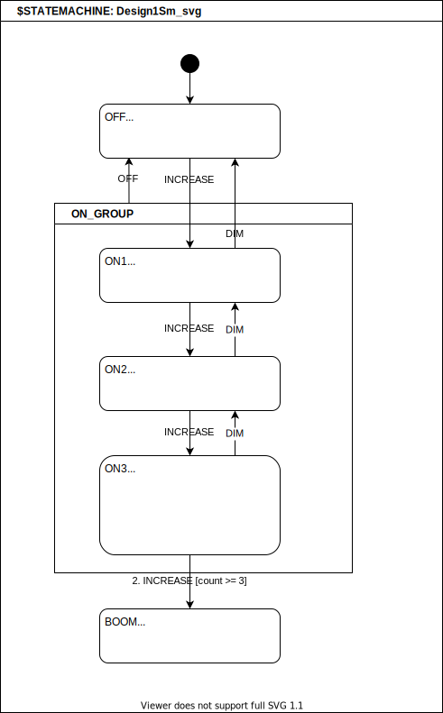

# Changelog
This project adheres to [Semantic Versioning](https://semver.org/spec/v2.0.0.html).

# Breaking Changes Are Rare 🌱
We do our best to avoid and minimize breaking changes.

That said, we will may occasionally have to make changes to StateSmith that may affect your projects. Help us get to `v1.0` faster!

You can easily find changes by searching for `"### Changed"` or `BREAKING-CHANGES` in the [changelog markdown file](https://github.com/StateSmith/StateSmith/blob/main/CHANGELOG.md?plain=1). I do my best to detail any required migration steps. Ask if you need help.

# Stability 🌉
The above might sound a bit scary, but the situation isn't that bad. I just want to be fully transparent.

We have a slew of state machine behavior specification tests to help ensure we don't accidentally break state machine behavior or make them lightly.

The majority of our breaking changes have been to code generation scripts (.csx files) as major features are implemented and require rework. Updating the .csx file scripts usually only takes a few minutes. Feel free to ask for help if you have any problems.

Release Template

```
## [some_version]
### Added
### Fixed
### Fixed (minor, major, ...)
### Changed
### Changed (BREAKING-CHANGES, minor, ...)
```

# Releases
Test/interim releases are not documented here.

## [0.14.0]
### Added
- Add `Java` transpiler (only supports algorithm `Balanced2` right now)
  - https://github.com/StateSmith/StateSmith/issues/393
- Add optimization to comment out unreachable behaviors in generated code
  - https://github.com/StateSmith/StateSmith/issues/394

---

## [0.13.2]
### Added
- `Balanced2` - remove un-necessary root state exit handler.
- `Balanced2` - add protection against infinite loop in the event of memory corruption.
  - https://github.com/StateSmith/StateSmith/issues/391
- `Balanced2` - add `"First ancestor handler for this event"` comment.

---

## [0.13.1]
### Added
- `Balanced2` - add optimization for single event state machines.
  - Add note assuming `event_id` parameter is valid for dispatch event function.
  - https://github.com/StateSmith/StateSmith/issues/388
- `Balanced2` - smarter code gen (remove unused func type).

---

## [0.13.0]
### Added
- NEW ALGORITHM: `Balanced2` - a variant of `Balanced1`. Instead of dynamically updating function pointers, `Balanced2` uses a more traditional switch/case mapping.
  - `Balanced2` is the new default algorithm.
  - `Balanced1` is still available for use.
  - https://github.com/StateSmith/StateSmith/issues/384

### Changed
- new algorithm `Balanced2` is now the default algorithm. See above.

---

## [0.12.2-alpha]
### Added
- C/C++ - Add more render config settings
  - `RenderConfig.C.HFileTopPostIncludeGuard`
  - `RenderConfig.C.HFileBottomPreIncludeGuard`
  - `RenderConfig.C.HFileBottom`
  - `RenderConfig.C.CFileBottom`
  - https://github.com/StateSmith/StateSmith/issues/385
- Console print StateSmith lib version when running: `StateSmith lib ver - X.Y.Z-tag+build`
  - https://github.com/StateSmith/StateSmith/issues/186

### Changed (minor)
- C/C++ - moved user includes to after StateSmith includes.
  - slight tidy to top of generated files

---

## [0.12.1-alpha]
### Contributors
- @diorcety
  - https://github.com/StateSmith/StateSmith/pull/376/

### Added
- C/C++ - Add support for standard `#ifdef` include guards (@diorcety)
  - https://github.com/StateSmith/StateSmith/issues/112
- C/C++ - Add support for old/odd compilers (@diorcety)
  - allow using `int` instead of `bool` for `bool` type. See `RenderConfig.C.UseStdBool` setting.
  - remove extra trailing comma in enum declarations.
  - https://github.com/StateSmith/StateSmith/pull/376/

---

## [0.12.0-alpha]
### Contributors
- @emmby
    - https://github.com/StateSmith/StateSmith/pull/370

### Fixed (minor)
- plantuml - allow line comments before `@startuml`
  - https://github.com/StateSmith/StateSmith/issues/352
- simulator - style $initial_state nodes as a black circle (@emmby)
  - https://github.com/StateSmith/StateSmith/issues/294
- improve exception printing & wording around propagate exceptions
  - https://github.com/StateSmith/StateSmith/issues/375
- plantuml - support character escape sequences properly
  - https://github.com/StateSmith/StateSmith/issues/369

### Added
- draw.io - allow multiple pages.
  - https://github.com/StateSmith/StateSmith/issues/78
- draw.io - allow declaring state machine without nesting.
  - https://github.com/StateSmith/StateSmith/issues/359
- allow declaring state machine name from `{fileName}`.
  - https://github.com/StateSmith/StateSmith/issues/330
- draw.io - add parse error location in exception message with help link.
  - https://github.com/StateSmith/StateSmith/issues/353
  - https://github.com/StateSmith/StateSmith/issues/354
- simulator - always show action code (even if blank) for non-transition behaviors.
  - https://github.com/StateSmith/StateSmith/issues/355
- improve draw.io disconnected edge error info
  - https://github.com/StateSmith/StateSmith/issues/378
- plantuml - support text align escape sequences
  - https://github.com/StateSmith/StateSmith/issues/362
- grammar - allow division operator `/` in guard and action code
  - https://github.com/StateSmith/StateSmith/issues/230
- simulator - improve guard evaluation dialog
  - https://github.com/StateSmith/StateSmith/issues/381

### Changed (minor)
- Slight change to draw.io xml parsing to allow for error location information.
  - https://github.com/StateSmith/StateSmith/issues/353
  
---

## [0.11.2-alpha]
### Fixed
- Fix error reporting for user injected code (via .csx) that has errors in it.
  - https://github.com/StateSmith/StateSmith/issues/283
- Fix error reporting when pre-parsing diagram for settings.
- Fix stack traces when pre-parsing diagram for settings.

### Changed (minor)
- Modified PreDiagramSettingsReader to not run validations on diagram when reading settings.
  - https://github.com/StateSmith/StateSmith/issues/349
- Slight change to error reporting for better user experience.
- Reword exception detail message to be non-csx specific.
  - https://github.com/StateSmith/StateSmith/issues/348

### Added
- Add help URL for user StateSmith grammar mistakes.
  - https://github.com/StateSmith/StateSmith/issues/174

---

## [0.11.1-alpha]
### Add
- Add plantuml support for `note on link`
  - https://github.com/StateSmith/StateSmith/issues/343

---

## [0.11.0-alpha]
### Add
- Add diagram based toml config for `RenderConfig` and `SmRunner.Settings`
  - Useful for plantuml as well which previously never had diagram based render config support.
  - https://github.com/StateSmith/StateSmith/issues/335
- simulator - show implicit `do` edge trigger explicitly
    - https://github.com/StateSmith/StateSmith/issues/316
- Add default expansions for variables and functions.
    - https://github.com/StateSmith/StateSmith/issues/284
- Add convenience helpers for `SmTransformer`.

### Fix
- simulator - prevent user diagram settings that could mess up generated simulation.
    - https://github.com/StateSmith/StateSmith/issues/337

---

## [0.10.0-alpha]
### Added
- Added ability to generate web based simulator.
  - https://github.com/StateSmith/StateSmith/issues/292
  - Simulator is very new and experimental. Feedback welcome.

### Changed (minor)
- deprecate `RunnerSettings.diagramFile` and add `RunnerSettings.DiagramPath` as alternative.

---

## [0.9.14-alpha]
### Fixed
- Fix grammar - allow `via`, `exit`, `entry` to be used in user guard and action code
  - https://github.com/StateSmith/StateSmith/issues/277
  - https://github.com/StateSmith/StateSmith/issues/211
### Added
- Added `IExpander` interface to allow users to provide their own expander class.
    - https://github.com/StateSmith/StateSmith/issues/275
- Added `class TrackingExpander : Expander` which tracks attempts for expansions.
    - This is currently an opt in feature and is not enabled by default.
    - Can be used to inspect a diagram to see what functions and variables are accessed.
    - https://github.com/StateSmith/StateSmith/issues/275

---

## [0.9.13-alpha]
### Fixed
- lang-csharp - don't output dammit operator when nullable disabled
    - https://github.com/StateSmith/StateSmith/issues/231

---

## [0.9.12-alpha]
### Added
- Added `LibVersionInfo` class to make it easier to get StateSmith version info.

---

## [0.9.10-alpha]
### Added
- PlantUML - support case insensitive stereo types for entryPoint, exitPoint, choice.
  - https://github.com/StateSmith/StateSmith/issues/227
- draw.io - validation - add help url to exception message for "nodes overlap"
  - https://github.com/StateSmith/StateSmith/issues/81
### Changed (minor)
- PlantUML - improve diagram element IDs for states.
  - Most people won't notice this unless generating an output file for git diffing.
  - Used to be something like `line_2_column_6`, but now matches unique state ID used in PlantUML diagram.

---

## [0.9.9-alpha]
### Added
- Add state machine description file for easier git diffing and understanding.
  - https://github.com/StateSmith/StateSmith/issues/200
- PlantUML - extend ignored diagram elements list.
  - Now supports `mainframe` and old skin `skin rose` (@chriesibaum).
  - https://github.com/StateSmith/StateSmith/issues/215
  - Now supports `title` (@yongzhy).
  - https://github.com/StateSmith/StateSmith/issues/216

---

## [0.9.7-alpha]
### Added
- Allow specifying index for `NamedVertex.AddEnterAction()` and `NamedVertex.AddExitAction()`.
  - https://github.com/StateSmith/StateSmith/issues/214

---

## [0.9.6-alpha]
### Added
- Add validation message for reserved state name "ROOT".
  - https://github.com/StateSmith/StateSmith/issues/199
### Changed (minor)
- Moved internal validation classes into `namespace StateSmith.SmGraph.Validation` from `namespace StateSmith.SmGraph`.
  - Most users won't be affected unless they perform their own custom validations.

---

## [0.9.5-alpha]
### Fixed (minor)
- Fix `ShortDescribingVisitor` to handle all vertex types and improve exception reporting.
  - https://github.com/StateSmith/StateSmith/issues/204
- Fix grammar so that entry/exit/choice point labels can be multiple digits
  - https://github.com/StateSmith/StateSmith/issues/207
### Changed (minor)
- special state vertices are described slightly differently to avoid clashing with user state names.
  - `ROOT.InitialState` becomes `ROOT.<InitialState>`...
  - https://github.com/StateSmith/StateSmith/issues/206

---

## [0.9.4-alpha]
### Fixed
- Fix auto name conflict resolution when all conflicting are descendants.
  - https://github.com/StateSmith/StateSmith/issues/198
### Added
- draw.io - support note shapes. They look nice, are less verbose, and more user friendly.
  - https://github.com/StateSmith/StateSmith/issues/192
### Changed (minor)
- Relaxed `$notes` validation. You can now have notes point to states and vice versa.
  - https://github.com/StateSmith/StateSmith/issues/190
- Relaxed and improved InnerHandlerText detection. Probably won't be noticed by users.
  - https://github.com/StateSmith/StateSmith/issues/191

---

## [0.9.3-alpha]
### Added
- Add C render config settings for enum attributes and file extension naming to support c++ nicer.
  - https://github.com/StateSmith/StateSmith/issues/185
### Fixed
- Fixed version 0.9.2 mistake that made `RunnerSettings.style` field readonly.

---

## [0.9.2-alpha]
### Added
- Exposed `AlgoBalanced1Settings` to disable event/state ID to string functions.
  - https://github.com/StateSmith/StateSmith/issues/181
### Regressions
- Mistakenly made `RunnerSettings.style` field readonly which broke advanced example that overrides code style.

---

## [0.9.1-alpha]
### Added
- Expansions - provide meta info (current state/vertex, trigger, behavior).
  - https://github.com/StateSmith/StateSmith/issues/45

---

## [0.9.0-alpha]
### Added
- TriggerMap - easier custom triggers
  - https://github.com/StateSmith/StateSmith/issues/161
- More flexible grammar to support syntax like `enter / menu.setItems(["BUILD YOUR BOT!", "ABOUT"]);`
  - https://github.com/StateSmith/StateSmith/issues/160
- Add setting to disable writing StateSmith version to generated files.
  - `SmRunner runner; runner.Settings.outputStateSmithVersionInfo = false;`
- Allow State Machine root to have behaviors.
  - https://github.com/StateSmith/StateSmith/issues/163
- Added grammar support for eating events with behavior text `MyEvent/`.
  - Before this change, you could use behavior text `MyEvent` instead.
  - https://github.com/StateSmith/StateSmith/issues/43
- Added validation to prevent `enter`/`exit` triggers on transition behaviors.
  - https://github.com/StateSmith/StateSmith/issues/162
- Ensure state machine has at least one event
  - https://github.com/StateSmith/StateSmith/issues/121

---

## [0.8.15-alpha]
### Fixed
- Fix history states when auto state name conflict resolution occurs.
  - https://github.com/StateSmith/StateSmith/issues/168
### Changed
- Altered order of `StandardSmTransformer` to fix #168 above.
  - `Standard_NameConflictResolution` now happens before supporting history.

---

## [0.8.14-alpha]
### Fixed
- Fix number parsing for `decimal comma` cultures (`15,6` vs. `15.6`).
  - https://github.com/StateSmith/StateSmith/issues/159

---

## [0.8.13-alpha]
### Added
- Support `else` guard.
  - See https://github.com/StateSmith/StateSmith/issues/136
- Ability to mix GIL and user code. Very helpful for functionality like TracingModder.
  - `$gil()` is now a reserved function used to mark GIL code.
  - https://github.com/StateSmith/StateSmith/issues/128
- js/c# - add whitespace around render config options
  - https://github.com/StateSmith/StateSmith/issues/156
- c/c++ - support RenderConfig.FileTop in addition to HFileTop and CFileTop
  - https://github.com/StateSmith/StateSmith/issues/155

---

## [0.8.12-alpha]
### Added
- js - added diagram based render config options
  - https://github.com/StateSmith/StateSmith/issues/23
- Now prints message saying files that are being written
  - `StateSmith Runner - Writing to file 'some_path/some_file.c'`

---

## [0.8.11-alpha]
### Changed
- Enabled automatic name conflict resolution by default
  - https://github.com/StateSmith/StateSmith/issues/138

### Fixed
- js - remove incorrect type hinting for "enums"
  - https://github.com/StateSmith/StateSmith/issues/153
- js, c# - tidy unused argument GIL instruction.
  - https://github.com/StateSmith/StateSmith/issues/148
- js - output static functions as static
  - https://github.com/StateSmith/StateSmith/issues/149
- js - improve whitespace when extending base class
  - https://github.com/StateSmith/StateSmith/issues/154

---

## [0.8.10-alpha]
### Fixed (minor)
- Remove duplicate `// Autogenerated with StateSmith` message.
  - https://github.com/StateSmith/StateSmith/issues/151

### Added
- Added more meta info to top of generated files.
  - https://github.com/StateSmith/StateSmith/issues/152
```c
// Autogenerated with StateSmith 0.8.10-alpha.
// Algorithm: Balanced1. See https://github.com/StateSmith/StateSmith/wiki/Algorithms
```

  - You can enable time stamping via `RunnerSettings.outputCodeGenTimestamp` bool field to get the following:
```c
// Autogenerated with StateSmith 0.8.10-alpha. Last run: 2023-03-21 10:51:06 PM.
// Algorithm: Balanced1. See https://github.com/StateSmith/StateSmith/wiki/Algorithms
```
- Added tracking of state nested handler diagram IDs. Useful for simulations.

### Changed 
- `IRenderConfigC` used to default to `// Autogenerated with StateSmith`, but now defaults
  to `""` for #151 and #152.

---

## [0.8.9-alpha]
### Fixes (minor)
- Fix extra gcc warning for `char const * const`
  - https://github.com/StateSmith/StateSmith/issues/150

---

## [0.8.8-alpha]
### Added
- Initial support for JavaScript transpiler target!!!

---

## [0.8.7-alpha]
### Added
- Added support for automatically resolving state name conflicts.
  - Defaults to manual conflict resolution for now, but will be enabled by default in the future.
  - You can enable with `SmRunner runner; runner.Settings.nameConflictResolution`.
  - You can also register your own `StateNameConflictResolver` class for custom control.
  - https://github.com/StateSmith/StateSmith/issues/138

---

## [0.8.6-alpha]
### Fixed
- fix specification bug - exit point transition only exits parent (not ancestors).
  - https://github.com/StateSmith/StateSmith/issues/132

---

## [0.8.5-alpha]
### Added
- `TimeStringParser` - very handy to use in expansions so that you can write guard clauses like `[ t1After(3 min) ]`.

---

## [0.8.4-alpha]
### Added
- GilToCsharp - method pointers instead of function pointers so that expansions rarely needed.
  - https://github.com/StateSmith/StateSmith/wiki/GIL:-Generic-Intermediate-Language
- GilToCsharp - add `IRenderConfigCSharp.UsePartialClass` which defaults to true.
- GilToCsharp - add `IRenderConfigCSharp.BaseList` allows you to specify a base class and/or implemented interfaces for the state machine.
  Very useful so you can define other part of partial class and easily add functionality
  to the state machine (fields, methods...).
- Added new name mangling options for state machine variables. See `NameMangler.cs`.
  - C# defaults to camelCase for vars.
- Added `StringUtils` helper methods to convert from `snake_case` to `PascalCase` and `camelCase`.
- Added `RunnerSettings.outputGilCodeAlways` for troubleshooting or transpiler authors.

---

## [0.8.3-alpha]
### Fixed
- Lower Roslyn dependencies to avoid issue with `dotnet-script`.
  - https://github.com/StateSmith/StateSmith/issues/123

---

## [0.8.2-alpha]
Won't work with `dotnet-script`. See https://github.com/StateSmith/StateSmith/issues/123

### Added
- improved transpiler dumping GIL code on error.
- GilToCsharp - a user output namespace is no longer required.
  - https://github.com/StateSmith/StateSmith/issues/122

----

## [0.8.1-alpha]
Won't work with `dotnet-script`. See https://github.com/StateSmith/StateSmith/issues/123

### Added
- improve HistoryProcessor's use of expansionVarsPathProvider
- improve user experience when transpilation error occurs (seen with incorrect custom user name mangling).
  - added `RunnerSettings.dumpGilCodeOnError` setting.
- add additional PostProcessing for custom user name mangling.
- allow user access to `GilToC99Customizer`

----

## [0.8.0-alpha]
Won't work with `dotnet-script`. See https://github.com/StateSmith/StateSmith/issues/123

Adds support for multiple languages! The 0.8.X releases will see more changes as we
figure out the best way to support multiple languages.

### Added
- Add support for generating C# state machine code as well as C99.
  - https://github.com/StateSmith/StateSmith/issues/107
- Only output `consume_event` variable when user action code uses it.
  - https://github.com/StateSmith/StateSmith/issues/98

### Changed
- Removed `RenderConfigC` from `SmSettings`. Moving towards language agnostic config.
- Removed `CNameMangler`. Use `NameMangler` and `ICFileNamer` instead. TODO document.
- Custom C99 enum attributes can be specified using `IGilToC99Customizer` now. TODO document & example.
- Removed `StateSmith.Output.C99BalancedCoder1` namespace.
- Changed how Name Mangling works. TODO document more. See examples update.
- C99 state machine argument passed to functions now named `sm` instead of `self`.
  - to help avoid clashing with some future languages.

---

## [0.7.16-alpha]
### Added
- support for user post processing
  - Can be used to remove `state_id_to_string()` function if not wanted.
  - Can be used to add custom functions.
  - Can be used to add code coverage annotations.
  - See https://github.com/StateSmith/StateSmith/issues/114

---

## [0.7.15-alpha]
### Added
- draw.io - convert more special characters to regular space characters (@FyrBridd).
  - https://github.com/StateSmith/StateSmith/issues/100
- improve trigger/event name case insensitivity.
  - Also document and expose more from `TriggerHelper` class.
- support `entry` as alternative to `enter` trigger.
  - https://github.com/StateSmith/StateSmith/issues/108

### Changed
- Internal API change to `Behavior` class
  - `.triggers` modifiable list renamed to `._triggers`.
  - Prefer using readonly `.Triggers` or `.SanitizedTriggers` instead.

---

## [0.7.13-alpha]
### Added
- Internal improvements to better support user custom code generation.
  - https://github.com/StateSmith/StateSmith/issues/89

---

## [0.7.12-alpha]
### Added
- draw.io - convert more HTML breaks (`<br style=...>`, `</br>`) to new line characters.
- draw.io - convert more special characters to regular space characters.
  - still some more to do: https://github.com/StateSmith/StateSmith/issues/100

---

## [0.7.11-alpha]
### Fixed
- Fix ignoring RenderConfig VariableDeclarations if they only contain comments

## Added
- Improve rendered code for state machine start function (skips un-necessary exiting).

---

## [0.7.10-alpha]
### Fixed
- Fix C# scripts not returning proper exit code on failure
  - Upstream cause: https://github.com/dotnet-script/dotnet-script/issues/700

---

## [0.7.9-alpha]
### Fixed
- Fix unused variable warning
  - https://github.com/StateSmith/StateSmith/issues/98

---

## [0.7.8-alpha]
### Added
- `IRenderConfigC.VariableDeclarations` is now ignored if it only contains comments.
- Simplified `SmRunner` API for public users.
  - https://github.com/StateSmith/StateSmith/issues/90

### Fixed
- `StringUtils.RemoveCCodeComments()` now removes single line comments `//...` that end with string end (no line break).

---

## [0.7.7-alpha]
### Fixed
- draw.io - convert HTML breaks `<br>` to new line characters.
- PrefixingModder - improve regex match accuracy.

### Added
- allow defining render config in diagram.
  - https://github.com/StateSmith/StateSmith/issues/23
- Add `AutoExpandedVars` functionality to make it easier to add variables.
  - https://github.com/StateSmith/StateSmith/issues/91
- Add experimental `TriggerModHelper`.

### Changed (minor)
- Renamed new class `DefaultSmTransformer` to `StandardSmTransformer`.
- Simplified transformer step registration.
- Renamed `$cmd` to `$mod` to better reflect the intent. These are commands or directives to modify the state machine.

---

## [0.7.6-alpha]
### Added
- added `SmTransformer` pipeline that allows custom user state machine transformation!
- added back ability to support designs with multiple state machines via `RunnerSettings.stateMachineName`.
- exceptions are now only dumped to file if explicitly enabled.
  - https://github.com/StateSmith/StateSmith/issues/82

### Changed (BREAKING-CHANGES)
- renamed namespaces that will affect user code generation scripts:
  - `using StateSmith.Compiling;` ---> `using StateSmith.SmGraph;`
  - `using StateSmith.compiling;` ---> `using StateSmith.SmGraph;`
  - `using StateSmith.output` ---> `using StateSmith.Output`

---

## [0.7.5-alpha]
### Added
- draw.io - detect when group isn't shown correctly
  - https://github.com/StateSmith/StateSmith/issues/81
- nuget package - Include documentation and source code for intellisense/debugging.
  - https://github.com/StateSmith/StateSmith/issues/80

---

## [0.7.4-alpha]
### Added
- `RunnerSettings.filePathPrintBase` to control how file paths are printed.
  - Required when C# scripts (.csx) are used.
  - https://github.com/StateSmith/StateSmith/issues/79

---

## [0.7.3-alpha]
### Added
- draw.io - add support for draw.io plugin and new drawing style where a state can have its text event handlers as a child text node instead of its label #77.
  - see `src/StateSmithTest/test-input/drawio/Design1Sm.drawio.svg` or expand section below
  - https://github.com/StateSmith/StateSmith/issues/77
  - child text must have matching style elements (in any order): `fillColor=none;gradientColor=none;strokeColor=none;resizable=0;movable=0;deletable=0;rotatable=0;`
    - this is already done if you use the plugin https://github.com/StateSmith/StateSmith-drawio-plugin

<details><summary>click here to see Design1Sm.drawio.svg</summary>


</details>

---

## [0.7.2-alpha]
### Added
- draw.io - embedded images inside of a draw.io diagram are now ignored. Issue #77.
  - images are sometimes embedded in state machine diagrams for documentation purposes.
- draw.io - treat null labels as blank instead of throwing exception. Null labels don't normally occur. Issue #77.
- improved `$notes` validations.

---

## [0.7.1-alpha]
### Added
- Add initial support for draw.io files as alternative to yEd files. https://github.com/StateSmith/StateSmith/issues/77
  - Supported file extensions:
    - `.drawio.svg` Recommended as design file is a valid svg image that can be used in markdown and other files!
    - `.drawio`
    - `.dio`

---

## [0.7.0-alpha]
### Changed
- Generated .h file now automatically includes `<stdint.h>` (required for history states).

### Added
- Add history. https://github.com/StateSmith/StateSmith/issues/63
  - Deep history functionality supported via history continue nodes.
  - plantuml supports history states and history continue nodes.
- Add `$prefix` methods.
  - Experimental feature to help with duplicate state names. https://github.com/StateSmith/StateSmith/issues/65

### Fixed
  - Pseudo state transition de-duplication now considers initial state parent incoming transition count too.
  - Improved exit handling optimization.

---

## [0.6.1-alpha]
### Added
- Improve generated code clarity by showing step 1,2,3... and other small things.
- Improve generated code clarity by removing `if (true)` for behaviors with no guard clause.
- Improve generated code by nulling `ancestor_event_handler` only when actually needed. https://github.com/StateSmith/StateSmith/issues/14
- Throw helpful exception message when duplicate state name used. Previously relied on c compiler and user to catch the problem.
```
VertexValidationException: Duplicate state name `OPTION` also used by state `Statemachine{LaserTagMenu1Sm}.State{MENUS_GROUP}.State{MAIN_MENU}.State{OPTION}`.
    Vertex
    Path: Statemachine{LaserTagMenu1Sm}.State{MENUS_GROUP}.State{MM_SHOW_INFO}.State{OPTION}
    Diagram Id: n0::n3::n2::n2
    Children count: 0
    Behaviors count: 3
    Incoming transitions count: 2
```

---

## [0.6.0-alpha]
### Fixed
- Fix parent self transition involving initial state incorrect https://github.com/StateSmith/StateSmith/issues/49
- StateSmith grammar fix for parsing 'e()'. https://github.com/StateSmith/StateSmith/issues/60

### Changed
- Transition actions are now run after states are exited (instead of before) https://github.com/StateSmith/StateSmith/issues/6
- Reserved `else` "trigger" name for `else` functionality https://github.com/StateSmith/StateSmith/issues/59

### Added
- Support `$choice` pseudo states/points https://github.com/StateSmith/StateSmith/issues/40
  - supported in PlantUML as well.
- Support multiple transitions for initial states, entry points, exit points. https://github.com/StateSmith/StateSmith/issues/40
  - Allow multiple transitions from initial state.
  - Initial state must have a default transition (always true).
  - Allow incoming transitions to initial state.
  - Allow multiple transitions from entry point.
  - Entry point must have a default transition (always true).
  - Allow incoming transitions to entry point.
  - Allow multiple transitions from exit point.
  - Exit point must have a default transition (always true).
- Allow specifying `else` on transitions https://github.com/StateSmith/StateSmith/issues/59
- Optimize pseudo state transitions to avoid code duplication.
  - Especially important for when History states are eventually implemented as the code de-duplication
  savings can rack up big there.
- Improve entry and exit point validations.
  - Detect duplicate labels in the same scope.
  - Allow exit points to target parent state. Same as a self transition on parent.
- grammar - support backtick strings and other ASCII symbols https://github.com/StateSmith/StateSmith/issues/42

## [0.5.9-alpha]
### Added
- Runner - set process exit code to -1 on failure.
- Runner - output additional exception details to `<diagram_file_path>.err.txt`.
  This is useful for generic assert like exceptions that don't yet have useful error messages.
  https://github.com/StateSmith/StateSmith/issues/38
- validation - new exception: `State machines must have exactly 1 initial state. Actual count: 0.`
- validation - helpful error messages for when state machine design is not found.
- Add Describe() methods for Behavior and Vertex.
- Add `TracingModder` class and experimental `Runner.postParentAliasValidation()` callback that allows graph modification.

### Fixed
- Root initial transition actions are now output. Had been ignored previously. Other initial transition actions were output properly. https://github.com/StateSmith/StateSmith/issues/47
- Parent to child transition now exits current child first. https://github.com/StateSmith/StateSmith/issues/46
- Parent to self transition now exits current child first. https://github.com/StateSmith/StateSmith/issues/48

---

## [0.5.7-alpha]
### Added
- detect yEd hidden edges https://github.com/StateSmith/StateSmith/issues/29
- Better error reporting regarding diagram edge IDs.
- Improve PlantUML parsing https://github.com/StateSmith/StateSmith/issues/21
  - `notes`, and improve parsing of malformed `skinparam` blocks.
- Prevent antlr4 error output to console.

### Fixed
- Now throws useful lexer stage exceptions instead of printing them and not recognizing the failure. https://github.com/StateSmith/StateSmith/issues/31 

---

## [0.5.6-alpha]
### Added
- Support [PlantUML input](./docs/plantuml-input.md) as an alternative to yEd input.
  Input file extension must be one of ".pu", ".puml", ".plantuml"
  https://github.com/StateSmith/StateSmith/issues/21

---

## [0.5.5-alpha]
### Fixed
- Fix generated comment regarding marking event as handled when not for a transition

---

## [0.5.4-alpha]
### Added
- Support `entry` and `exit` points https://github.com/StateSmith/StateSmith/issues/3
- Initial support for `$PARENT_ALIAS` nodes. https://github.com/StateSmith/StateSmith/issues/2
- Improve exception error messages

---

## [0.5.3-alpha]
### Fixed
- Fix generated comment about exiting to LCA name
- Fix `FinishCodeBlock()` when `BracesOnNewLines = false;`
