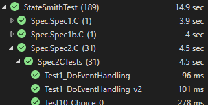

# StateSmith
StateSmith is a cross platform, free/open source tool for generating state machines in multiple programming languages. The generated code is human readable, has zero dependencies and is suitable for use with tiny bare metal microcontrollers, video games, apps, web, computers... It avoids dynamic memory allocations for the safety or performance inclined.

*The above is [my current plan](https://github.com/StateSmith/StateSmith/wiki/Multiple-Language-Support), but I'll gladly help anyone add a new language. I'm hoping contributors will help me with this effort.*

 

# Features and Interactive Examples 🌟
The [fundamentals-1](https://statesmith.github.io/fundamentals-1/) webpage has simple interactive examples that let you explore most StateSmith features.

 

# Quick Start (all supported languages) 🚀
Want to jump right in and just try it!?

🔥 [Tutorial-3 (recommended)](https://github.com/StateSmith/tutorial-3) uses new StateSmith features that are easier to use. It is a good starting point for most. `PlantUML` `CLI` `no install required` 

[Tutorial-2](https://github.com/StateSmith/tutorial-2) uses the older method of C# script (.csx) files which are still actively supported. The .csx approach is more complicated, but also enables advanced features and deep customization for power users. Tutorial 2 also uses **draw.io** which gives you maximum control, but currently has a few more "gotchas" compared to PlantUML (improvements are coming).  `draw.io` `.csx` `requires dotnet install`  

 

# Stay in the Know 📰
Our announcements [discord](https://discord.com/invite/rNxNGQXWsU) channel is updated when new tutorials and features are added.

YouTube channel: https://www.youtube.com/@statesmith

 

# Why State Machines and StateSmith? 🤔
If you are new to state machines, then prepare to level up your toolbox! They are incredibly helpful for [certain applications](https://github.com/StateSmith/StateSmith/wiki/App-Notes).

Why StateSmith?
I couldn't find a quality state machine code generator that met my needs, had an attractive license, and was enjoyable to use.

## The Diagram is Always Accurate! 📚
Before I created StateSmith, it was always a pain trying to manually synchronize a hand written state machine with a drawing. Urgent client requests come in and you update the code, but do you and your team always remember to update the drawing? Probably not and so the rot begins. Documentation trust issues arise and as designs get larger, the effort to ensure the diagram is accurate starts to become quite punishing.

Now that we use StateSmith at my work, I never have to worry about the above. I love generating fully working code **from** the documentation. Incredibly helpful for teams and communicating with clients.

 

# More Examples 🔫
The [StateSmith-examples](https://github.com/StateSmith/StateSmith-examples) repo has a growing list of examples showcasing different [application uses](https://github.com/StateSmith/StateSmith/wiki/App-Notes).

 

# Please Consider Advising/Contributing 📈
If you like StateSmith and want to help improve it, your help would be very much appreciated! StateSmith is a pretty decent tool right now, but it is going to take a team to elevate it to the next level.

* You can help without writing code. StateSmith needs more [user feedback/guidance](https://github.com/StateSmith/StateSmith/wiki/User-Feedback) before it can hit version 1.0.
* If you are up for coding, check out [Contributing](https://github.com/StateSmith/StateSmith/wiki/Contributing).

Thanks!

 

# Is StateSmith ready for use? 🧪
> We use StateSmith in a fair number of production projects at my work. It's been super helpful.

StateSmith is generating working code, and has good test (598+) and behavior specification coverage. There are 45+ specification integration tests that read a diagram file, generate executable state machine code, then compile and execute that code in another process and ensure that the state machine behavior is exactly what was expected. This strong test base gives me confidence. It also allows us to refactor and optimize StateSmith without fear of accidentally breaking specified behavior.

  

Breaking changes and migration steps will be documented in [./CHANGELOG.md](./CHANGELOG.md) and should be pretty minimal.

 

# More Info 📖
The StateSmith [GitHub wiki](https://github.com/StateSmith/StateSmith/wiki) has a good amount of documentation right now, but always feel free to ask a question.

 

# Need help? Suggestion? Brainstorm? 🙋
Join us on [discord](https://discord.com/invite/rNxNGQXWsU).

Feel free to open a [github issue](https://github.com/StateSmith/StateSmith/issues).

Or you can use the project's [discussion space](https://github.com/StateSmith/StateSmith/discussions).

