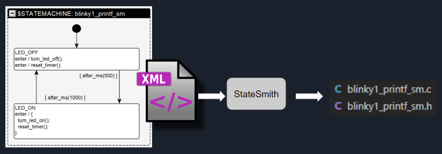
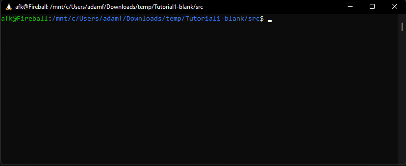
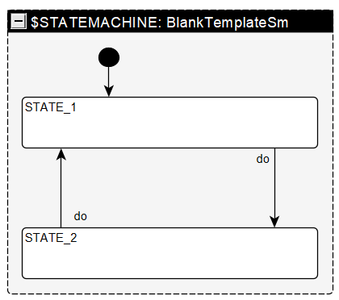
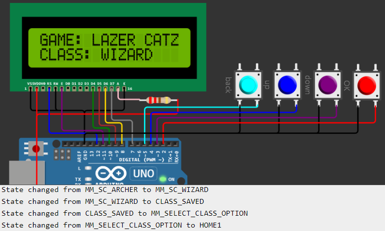
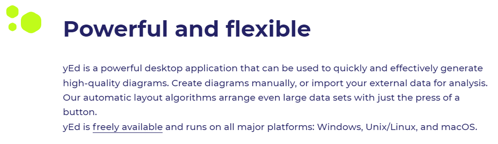

# StateSmith
StateSmith is a cross platform, free/open source tool for generating state machines. The generated code is human readable, has zero dependencies and is suitable for use with tiny bare metal microcontrollers, kernels, or servers. It avoids dynamic memory allocations for the safety or performance inclined.

StateSmith will one day generate code for multiple different languages, but for now, the focus is on good old `C` (or `C++`) with zero dependencies.

  

# What's new?
It's been about 5 months since StateSmith was initially released and we've got a lot of awesome improvements!


🎉 The biggest news is that we now have `draw.io` support and a plugin for it! It's working really well!

⭐ Collaboration ready - Join us on [discord](https://discord.com/channels/1056394875278462996/1056394875278462999). StateSmith's core has been significantly cleaned up and is ready for collaboration. I'll be spending more time on [documentation](https://github.com/StateSmith/StateSmith/wiki) and [creating videos](https://www.youtube.com/@statesmith).

💻The other massive improvement is that the workflow is way nicer with `dotnet script`.

[Full 5 month update details here.](https://github.com/StateSmith/StateSmith/wiki/Update-Highlights-(v0.5.4-to-v0.7.11))

The [backlog project](https://github.com/orgs/StateSmith/projects/1) shows planning and status of features.

## Demo
Here's a demo [youtube video](https://www.youtube.com/watch?v=9czSDothuzM) showing a Laser Tag menu implemented with StateSmith and running in an Arduino simulation.

[](https://www.youtube.com/watch?v=9czSDothuzM)


## Quick Start 🚀
Want to jump right in and just try it!?
See [quick-start.md](./docs/quickstart1/quick-start.md)

You'll be controlling a console light bulb's brightness in no time!



See also the [examples](./examples/README.md).

## Need help? Suggestion? Brainstorm?
Feel free to open a [github issue](https://github.com/StateSmith/StateSmith/issues).

Or you can use the project's [discussion space](https://github.com/StateSmith/StateSmith/discussions).

## Why StateSmith?
I couldn't find a state machine code generator that was suitable for low level embedded application use, had an attractive license, and was enjoyable to use.

Many options were painfully slow to use. You couldn't just start designing/writing code. You had to spend a bunch of time creating object oriented mappings of every little thing in an awkward GUI.

One of the reasons why I like StateSmith so much is that you can just get started using it and write code how you want. You can even start with pseudo code and gradually shape it into real code. Even though StateSmith uses a GUI for drawing state machines, all of a state's functionality is written in text - no annoying awkward GUIs that slow you down.

## Human Readable Code

To make the generated code as enjoyable to look at as possible, there are a fair number of customizations possible. You can easily create a custom name mangling for pretty much everything.

The default naming strategy looks like this:
```c
// State machine constructor...
void LaserTagMenu1Sm_ctor(LaserTagMenu1Sm* self);
```

But, you can easily customize to output another common naming convention like this:
```c
// State machine constructor...
void blinky1_printf_sm_ctor(blinky1_printf_sm* self);
```

<!-- Here's the example customization [code](https://github.com/StateSmith/StateSmith/blob/dev/examples/Blinky1Printf/CodeGen/Blinky1PrintfSm.cs#L84-L109) used for `blink1_printf_sm` above. -->

## Show me the code!

In the future, StateSmith will support numerous state machine code generators. You'll be able to choose from super fast, balanced, and tiny size. You'll also be able to implement your own. 
The current code generation strategy implements a balanced approach that will work well for various targets.

For the below diagram, here's the generated [.h file](./examples/BlankTemplate/BlankTemplate/BlankTemplateSm.h) and [.c file](./examples/BlankTemplate/BlankTemplate/BlankTemplateSm.c).

  

The above state machine isn't very interesting. It just transitions between one state and another state when the `do` event is dispatched to it.

## A more interesting example: Laser Tag Menu! Pew pew! 🔫

There are a bunch of [examples](./examples/README.md). Below is one of them.

  

You can interact with the generated laser tag menu code using the [wokwi simulation](https://wokwi.com/projects/351165738904453719).

Here's the menu layout:
```
APP
├── HOME
│   ├── HOME1
│   ├── HOME2
│   └── HOME3
└── MAIN MENU
        ├── SELECT CLASS
        │   ├── ENGINEER
        │   ├── HEAVY
        │   ├── ARCHER
        │   ├── WIZARD
        │   └── SPY
        │── SHOW INFO
        │   ├── INFO 1
        │   ├── INFO 2
        │   └── INFO 3
        └── EAT BACK PRESSES
            └── <stuff to show event handling>
```

Here's the [design diagram](images/yed-LaserTagMenu1Sm-outer.png). To view inside collapsed states like `MM_SELECT_CLASS`, you'll need to open the diagram using the UI (see below).


## User Interface
StateSmith doesn't actually provide a UI - it currently relies on the free to use, but closed source [yEd editor](https://www.yworks.com/products/yed).

  

yEd is great because it is free to use (even for commercial use), cross platform, and meets our needs pretty well once you get used to it.

StateSmith parses the yEd xml file, builds some intermediate graph representations (which will allow user modification soon), then passes the graph to the code generator.

One major future goal is to create a draw.io vscode extension that we can use for the front end. StateSmith was written with this goal in mind so adding a different compiler front end will be relatively easy. The hard part is customizing draw.io to behave the way we need (entering collapsed groups). I did a quick proof of concept and it looks very doable, just needs time and hopefully an excited contributor that is good with web UIs :)

Why use yEd? I like that we just type in text. Some of the other strict UML State Machine tools I tried drove me crazy. It was just so slow to do anything.

## How to use yEd for StateSmith
See [./docs/yed-training.md](./docs/yed-training.md)


# Is StateSmith ready for use? 🧪
StateSmith is generating working code, and has decent test (236+) and behavior specification coverage. There are 45+ specification integration tests that read a diagram file, generate executable .c state machine code, then compile and execute that .c code in another process and ensure that the state machine behavior is exactly what was expected. This strong test base gives me confidence. It also allows us to refactor and optimize StateSmith without fear of accidentally breaking specified behavior.

  

Every aspect of state behavior is printed during specification testing with the help of the `TracingModder` class which modifies the state machine design before the code generation step.
```
Dispatch event EV1
===================================================
State TEST6_S1: check behavior `1. EV1 / { count++; }`. Behavior running.
State TEST6_S1: check behavior `2. EV1 [count >= 2] TransitionTo(TEST6_S2)`. Behavior skipped.

Dispatch event EV1
===================================================
State TEST6_S1: check behavior `1. EV1 / { count++; }`. Behavior running.
State TEST6_S1: check behavior `2. EV1 [count >= 2] TransitionTo(TEST6_S2)`. Behavior running.
Exit TEST6_S1.
Transition action `` for TEST6_S1 to TEST6_S2.
Enter TEST6_S2.
```
*Note that there isn't a stable API yet for user modification of state machine designs, but it is coming (super useful).*


Release 0.5.4-alpha added a lot of helpful error messages for when the input design is incorrect in some way:
```c
Failed parsing diagram edge
from: Statemachine{LaserTagMenu1Sm}.State{MENUS_GROUP}.State{MM_SELECT_CLASS}
to:   Statemachine{LaserTagMenu1Sm}.State{MENUS_GROUP}.State{CLASS_SAVED}
Edge label: `via exitt saved`
Reason(s): mismatched input 'exitt' expecting {'entry', 'exit'} at line 1 column 4. Offending symbol: `exitt`.
           extraneous input 'saved' expecting <EOF> at line 1 column 10. Offending symbol: `saved`.
Edge diagram id: n0::n3::e3
```

The main thing I'd like to caution at this point is that there will be some refactoring in the near future which may affect user code generation scripts. Breaking changes and migration steps will be documented in [./CHANGELOG.md](./CHANGELOG.md) however and should be pretty minimal.


# Features
See [./docs/diagram-features.md](./docs/diagram-features.md)


# How To Run StateSmith

StateSmith is still in alpha development phase so please be patient :)

There will eventually be a standalone CLI tool that has no installation dependencies and works cross platform. See [issue 10](https://github.com/StateSmith/StateSmith/issues/10).

For now, we actually just run StateSmith as a regular C# project from the command line, vscode, or visual studio.

# Tutorial

See [quick-start.md](./docs/quickstart1/quick-start.md)


