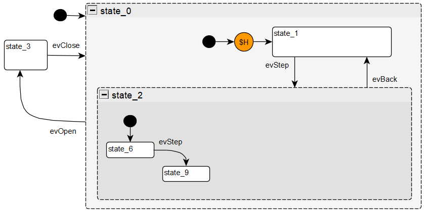
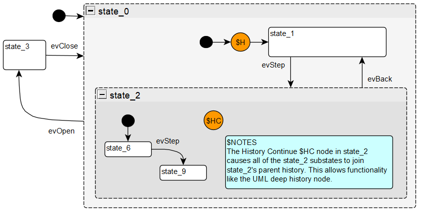
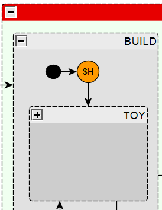
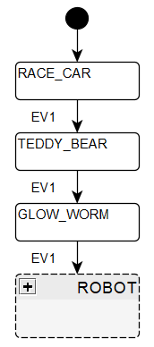
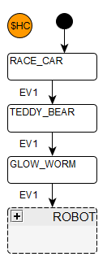
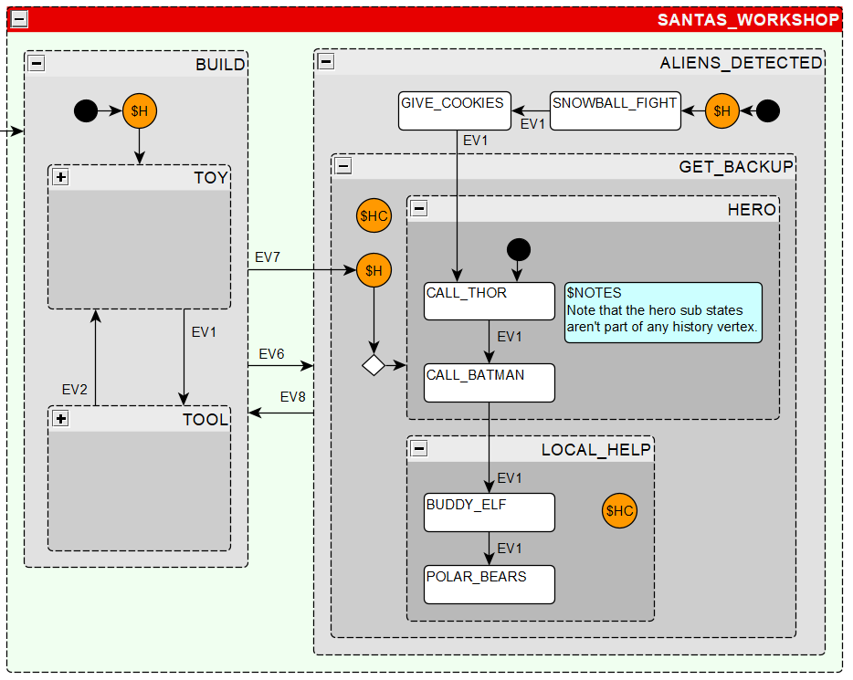
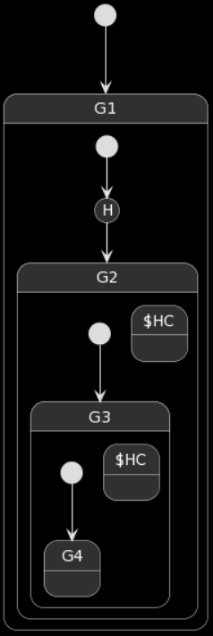
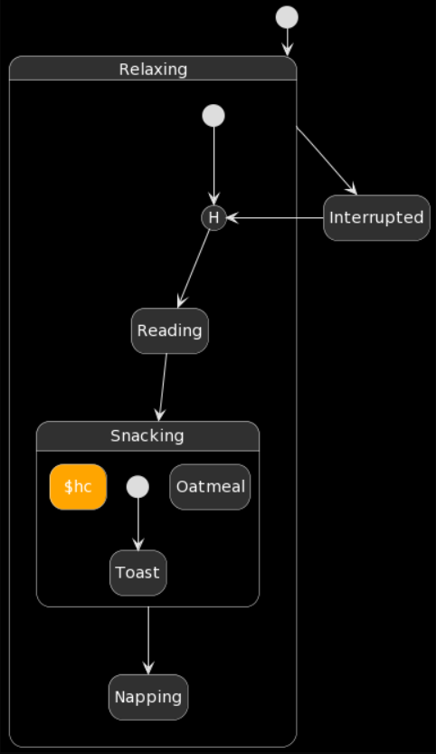

# History Vertex Functionality
The StateSmith History Vertex `$H` allows you to track sub state history. The History Continue `$HC` vertex allows you achieve selective "deep history" functionality (more details below).

Another name for a history vertex is a history state or pseudo state.

A history vertex is a diagram node with label `$H`. You can style it to have any shape/color you like.

A history vertex must have a single transition drawn from it. This is the default transition it will take if it is entered, but doesn't have a remembered state yet.

## Shallow History

In the below diagram, you can see `state_1` and `state_2` are remember by the History Vertex. This is considered "shallow history" because `state_2`'s sub-states are not remembered.

  

This diagram above comes from `amigomcu`'s issue: https://github.com/StateSmith/StateSmith/issues/56

If we start in `state_1`, and then dispatch event `evStep`, the state machine will transition to `state_2` and then `state_6`:
```
Dispatch event evStep
===================================================
State state_1: check behavior `evStep TransitionTo(state_2)`. Behavior running.
Exit state_1.
Enter state_2.
Enter state_6.
```

Event `evStep` will cause a transition to `state_9`:
```
Dispatch event evStep
===================================================
State state_6: check behavior `evStep TransitionTo(state_9)`. Behavior running.
Exit state_6.
Enter state_9.
```

Event `evOpen` will cause a transition to `state_3`:
```
Dispatch event evOpen
===================================================
State state_0: check behavior `evOpen TransitionTo(state_3)`. Behavior running.
Exit state_9.
Exit state_2.
Exit state_0.
Enter state_3.
```

Event `evClose` will cause a transition back to `state_0` and its history vertex. The history vertex remembers that it was last in `state_2` so it transitions directly to it:
```
Dispatch event evClose
===================================================
State state_3: check behavior `evClose TransitionTo(state_0)`. Behavior running.
Exit state_3.
Enter state_0.
Enter state_2.
Enter state_6.
```

<details>
  <summary>Click here to see detailed event handling from specification test</summary>
  
```
Dispatch event evStep
===================================================
State state_1: check behavior `evStep TransitionTo(state_2)`. Behavior running.
Exit state_1.
Transition action `` for state_1 to state_2.
Enter state_2.
State state_2: check behavior `enter / { $state_0_history = state_2; }`. Behavior running.
Transition action `` for state_2.InitialState to state_6.
Enter state_6.

Dispatch event evStep
===================================================
State state_6: check behavior `evStep TransitionTo(state_9)`. Behavior running.
Exit state_6.
Transition action `` for state_6 to state_9.
Enter state_9.

Dispatch event evOpen
===================================================
State state_0: check behavior `evOpen TransitionTo(state_3)`. Behavior running.
Exit state_9.
Exit state_2.
Exit state_0.
Transition action `` for state_0 to state_3.
Enter state_3.

Dispatch event evClose
===================================================
State state_3: check behavior `evClose TransitionTo(state_0)`. Behavior running.
Exit state_3.
Transition action `` for state_3 to state_0.
Enter state_0.
Transition action `` for state_0.InitialState to state_0.History.
Transition action `` for state_0.History to state_2.
Enter state_2.
State state_2: check behavior `enter / { $state_0_history = state_2; }`. Behavior running.
Transition action `` for state_2.InitialState to state_6.
Enter state_6.
```
</details>

---


## Deep History

In the below diagram, you can see `state_1`, `state_2`, `state_6` and `state_9` are remember by the History Vertex. The History Continue vertex `$HC` in `state_2` causes it's sub states (`state_6` and `state_9`) to join the same history vertices that `state_2` belongs to.  This is considered "deep history".

  

The below example is very similar to above except that it ends in `state_9` instead of `state_6`. 

If we start in `state_1`, and then dispatch event `evStep`, the state machine will transition to `state_2` and then `state_6`:
```
Dispatch event evStep
===================================================
State state_1: check behavior `evStep TransitionTo(state_2)`. Behavior running.
Exit state_1.
Enter state_2.
Enter state_6.
```

Event `evStep` will cause a transition to `state_9`:
```
Dispatch event evStep
===================================================
State state_6: check behavior `evStep TransitionTo(state_9)`. Behavior running.
Exit state_6.
Enter state_9.
```

Event `evOpen` will cause a transition to `state_3`:
```
Dispatch event evOpen
===================================================
State state_0: check behavior `evOpen TransitionTo(state_3)`. Behavior running.
Exit state_9.
Exit state_2.
Exit state_0.
Enter state_3.
```

Event `evClose` will cause a transition back to `state_0` and its history vertex. The history vertex remembers that it was last in `state_9` so it transitions directly to it:
```
Dispatch event evClose
===================================================
State state_3: check behavior `evClose TransitionTo(state_0)`. Behavior running.
Exit state_3.
Enter state_0.
Enter state_2.
Enter state_9.
```


<details>
  <summary>Click here to see detailed event handling from specification test</summary>


```
Dispatch event evStep
===================================================
State state_1: check behavior `evStep TransitionTo(state_2)`. Behavior running.
Exit state_1.
Transition action `` for state_1 to state_2.
Enter state_2.
State state_2: check behavior `enter / { $state_0_history = state_2; }`. Behavior running.
Transition action `` for state_2.InitialState to state_6.
Enter state_6.
State state_6: check behavior `enter / { $state_0_history = state_6; }`. Behavior running.

Dispatch event evStep
===================================================
State state_6: check behavior `evStep TransitionTo(state_9)`. Behavior running.
Exit state_6.
Transition action `` for state_6 to state_9.
Enter state_9.
State state_9: check behavior `enter / { $state_0_history = state_9; }`. Behavior running.

Dispatch event evOpen
===================================================
State state_0: check behavior `evOpen TransitionTo(state_3)`. Behavior running.
Exit state_9.
Exit state_2.
Exit state_0.
Transition action `` for state_0 to state_3.
Enter state_3.

Dispatch event evClose
===================================================
State state_3: check behavior `evClose TransitionTo(state_0)`. Behavior running.
Exit state_3.
Transition action `` for state_3 to state_0.
Enter state_0.
Transition action `` for state_0.InitialState to state_0.History.
Transition action `` for state_0.History to state_9.
Enter state_2.
State state_2: check behavior `enter / { $state_0_history = state_2; }`. Behavior running.
Enter state_9.
State state_9: check behavior `enter / { $state_0_history = state_9; }`. Behavior running.
```

</details>

---

## Why not implement UML `H+` deep history?

There are 2 main problems that I see with UML `H+` deep history nodes.

1. There is no way to specify a level at which to stop adding sub states to the deep history. This can lead to awkward designs and workarounds.
2. More importantly, deep history behavior may not be apparent when zoomed into a deeply nested state machine and the history vertex is no longer visible. This is a potential source of confusion and bugs that we can avoid. In the below image, the `TOY` state is a collapsed group:



When the `TOY` state is opened in the editor, the user can no longer see the history vertex and may be unaware of the history behavior at this level:

  


StateSmith History Continue vertices `$HC` overcome both the above issues:

1. You simply keep adding `$HC` vertices to the depth that you want tracked by the history vertex.
2. The presence of a `$HC` vertex inside a group makes it clear that there is history behavior.

  


The below diagram comes for a specification test and shows some interesting things that you can do with history vertices.

  

The default transition from a history vertex can be to another pseudo state (like a choice point).

You can have multiple history states at different levels. The below generated enumerations show the states that the different history vertices track:

```c
enum Spec2Sm_ALIENS_DETECTED_HistoryId
{
    Spec2Sm_ALIENS_DETECTED_HistoryId__SNOWBALL_FIGHT = 0, // default transition
    Spec2Sm_ALIENS_DETECTED_HistoryId__GIVE_COOKIES = 1,
    Spec2Sm_ALIENS_DETECTED_HistoryId__HERO = 2,
    Spec2Sm_ALIENS_DETECTED_HistoryId__BUDDY_ELF = 3,
    Spec2Sm_ALIENS_DETECTED_HistoryId__POLAR_BEARS = 4,
};

enum Spec2Sm_GET_BACKUP_HistoryId
{
    Spec2Sm_GET_BACKUP_HistoryId__GET_BACKUPChoicePoint = 0, // default transition
    Spec2Sm_GET_BACKUP_HistoryId__HERO = 1,
    Spec2Sm_GET_BACKUP_HistoryId__BUDDY_ELF = 2,
    Spec2Sm_GET_BACKUP_HistoryId__POLAR_BEARS = 3,
};

enum Spec2Sm_BUILD_HistoryId
{
    Spec2Sm_BUILD_HistoryId__TOY = 0, // default transition
    Spec2Sm_BUILD_HistoryId__TOOL = 1,
    Spec2Sm_BUILD_HistoryId__RACE_CAR = 2,
    Spec2Sm_BUILD_HistoryId__TEDDY_BEAR = 3,
    Spec2Sm_BUILD_HistoryId__GLOW_WORM = 4,
    Spec2Sm_BUILD_HistoryId__ROBOT = 5,
    Spec2Sm_BUILD_HistoryId__BATTLEBOT = 6,
    Spec2Sm_BUILD_HistoryId__WALL_E = 7,
    Spec2Sm_BUILD_HistoryId__IMPACT_DRILL = 8,
    Spec2Sm_BUILD_HistoryId__CIRCULAR_SAW = 9,
};
```
## PlantUML Support
You can use normal history vertices in PlantUML like `[H]`. If you want to declare a History Continue vertex, use syntax like `state "$HC" as hc1`.

Basic [Example](https://www.plantuml.com/plantuml/duml/SoWkIImgAStDKN2jICmjo4aDpkMArefLqDMrKt0tv0BAbgG26GhLN0f009E9zeY5y3sWAet0NAXg8wXgP1tknc0XX2eb5Gzd9ON4OeMCP4DKAQ1Qg04OXfY0XN4QP0INhkM2aBLS3gbvAK3l0G00):

  

```plantuml
@startuml ExampleSm
[*] --> G1
state G1 {
    [*] --> [H]
    [H] --> G2
    state G2 {
        [*] --> G3
        state "$HC" as hc1
        state G3 {
            [*] --> G4
            state "$HC" as hc2
        }
    }
}
@enduml
```

Nicer looking [example](https://www.plantuml.com/plantuml/duml/ROzFImCn4CNlyoc6uademNifHH7gHS5wApqCoR0RcZyXcOMAzBkRpJegOaupxpSlCszNXOfCmUFZXKBsV0WmEil88SixMgwck2mkHO1wTZ5JeO3D98mVWEtTapaF9KtHFYIVocOpckqMKw4uC5m1ZhSdNA-t-CgUBYuEi9Yr_Vf5fuxxqzBlrKLsDZL9wwuVObkhG9jEdYdd6NJITodNNJzWTJEQ5LB5qTmjXtyFw45lYQhyiVsdlP049j_LQylTy-bDJr6ub2aBM_XLTwQ3S_8THpi5_ma0):

  


```plantuml
@startuml ExampleSm
hide empty description

skinparam state {
    BackgroundColor<<hc>> orange
}

[*] --> Relaxing
state Relaxing {
    [*] --> [H]
    [H] --> Reading
    Reading --> Snacking
    Snacking --> Napping

    state Snacking {
        state "$hc" as hc1<<hc>>
        [*] --> Toast
        state Toast
        state Oatmeal
    }
}
Relaxing --> Interrupted
Interrupted --> Relaxing[H]
@enduml
```

## More info
Tracking issue: https://github.com/StateSmith/StateSmith/issues/63
