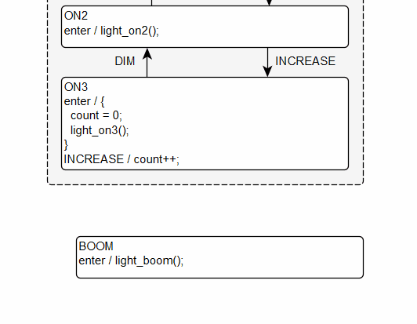

# See Tutorial 2 Instead
This is our original quick start from when we used the yEd editor. That is still supported, but not recommended for new users.

https://github.com/StateSmith/tutorial-2


<br>
<br>
<br>
<br>
<br>
<br>
<br>

# Old yEd Quick Start

Download the StateSmith repo and copy `./examples/Tutorial1-blank/` somewhere you want to use it. You can also leave it where it is.

I'll be using WSL2 in my windows `Downloads/temp` directory.
```console
afk@Fireball:/mnt/c/Users/adamf/Downloads/temp/Tutorial1-blank$
```

# Check requirements
Type `dotnet --version` on the command line to see if you have the C# [dotnet 6 sdk installed](https://dotnet.microsoft.com/en-us/download/dotnet/sdk-for-vs-code).

If not, download using the link above.
```console
afk@Fireball:/mnt/c/Users/adamf/Downloads/temp/Tutorial1-blank$ dotnet --version
6.0.401
```

At some point in the future, we will release a version that doesn't require installing dotnet.

Type `gcc --version` on the command line to see if you have gcc installed.

```console
afk@Fireball:/mnt/c/Users/adamf/Downloads/temp/Tutorial1-blank$ gcc --version
gcc (Ubuntu 9.4.0-1ubuntu1~20.04.1) 9.4.0
Copyright (C) 2019 Free Software Foundation, Inc.
This is free software; see the source for copying conditions.  There is NO
warranty; not even for MERCHANTABILITY or FITNESS FOR A PARTICULAR PURPOSE.
```

# Smoke test!
Lets try and run the state machine code generation, compile the c program and run it all in a single go!

cd to `src` and run `./compile_and_run.sh`. It will generate the state machine code, compile it, and run it.

You should see the following:


<!-- 
```console
afk@Fireball:/mnt/c/Users/adamf/Downloads/temp/Tutorial1-blank$ cd src
afk@Fireball:/mnt/c/Users/adamf/Downloads/temp/Tutorial1-blank/src$ ./compile_and_run.sh 
MSBuild version 17.3.1+2badb37d1 for .NET
  Determining projects to restore...
  Restored /mnt/c/Users/adamf/Downloads/temp/Tutorial1-blank/CodeGen/CodeGen.csproj (in 321 ms).
  CodeGen -> /mnt/c/Users/adamf/Downloads/temp/Tutorial1-blank/CodeGen/bin/Debug/net6.0/CodeGen.dll

StateSmith Runner - Compiling file: `src/Tutorial1Sm.graphml`
StateSmith Runner - finished normally.

---------------------------------------

Tutorial1 C Code Running!

USAGE:
  type i <enter> to send INCREASE event to state machine
  type d <enter> to send DIM event to state machine
  type o <enter> to send OFF event to state machine

hit <enter> to start
```

If you type enter, you should see an off lightbulb.
```
    _------_   
  -~        ~-   
 -     _      -   
-      ||      -   
-      ||      -   
 -     ||     -   
  -    ||    -   
   -   ||   -   
    -__||__-   
    |______|   
    <______>   
    <______>   
       \/   
```

Type i then enter, and it should turn on somewhat.

```
    _------_   
  -~  .   . ~-   
 - .   _    . -   
-      ||      -   
-  .   ||   .  -   
 -    .||.    -   
  -  .<||>.  -   
   - .<||>. -   
    -__||__-   
    |______|   
    <______>   
    <______>   
       \/   
```

Type d then enter and it should turn back off. -->

Follow the printed usage instructions to send different events to your state machine.

That's how the state machine should function. Let's check out the initial design.

# Open the diagram
Open the file `src/Tutorial1Sm.graphml` using the [yEd editor](https://www.yworks.com/products/yed). If you haven't used yEd before, see [yed-training.md](./../yed-training.md). There's a few important points in there.

You should see this in the center of the screen.

  

Double click the center of the state machine to enter it. You should see the following:

  

The state machine first transitions from the initial pseudo state (black circle) to the `OFF` state.

When the `OFF` state is entered, it calls the c code `light_off();`. This is declared in `light.h`


When the `INCREASE` event is dispatched to the state machine, it transitions to state `ON1` and runs the code `light_on1();`.

Note that the only auto generated files in this example are `Tutorial1Sm.c/.h`. The other few files are user supplied code.

When either the `DIM` or `OFF` events are dispatched to the state machine, it transitions back to the `OFF` state...

# Let's add more states

Select the `ON1` shape and copy paste it.

Edit the label of the new shape and paste in this:
```
ON2
enter / light_on2();
```
<!--    -->


Draw an edge transition from `ON2` to `ON1` by click and dragging from `ON2` to `ON1`. Use the edge controls
to move the edge over a bit.

<!--  -->

With the new edge selected, press F2 to edit its label (or right click). Give it the label `DIM`.

Repeat the above process to draw a transition from `ON1` to `ON2` and give that edge the label `INCREASE`.

You can drag the edge labels around. By default yEd slightly restricts where you can move the edge label. You can modify that in the edge's properties (right click on it) or you can do it in bulk as explained in the yed training.

Your design should look like this:

  

# Test it out!
You should now be able to use 2 brightness levels for the light bulb.


# Add another state

Add state `ON3` with the below label and wire up the transitions like before.
```
ON3
enter / light_on3();
```

Your design should look something like below.

  


# Ruh-roh! There's a problem in our design

You've probably already noticed it, but we have a problem.

Only state `ON1` listens to the `OFF` event, but `ON2` and `ON3` should also listen to it.

At this point we have 2 main options:
- Option 1: draw a transition from `ON2` to `OFF` and from `ON3` to `OFF`, but this doesn't scale very well after a few states.
The diagram starts to become a spaghetti mess.
- Option 2: we group all the on states into a parent state that listens to the `OFF` event. This is definitely my preferred approach in most cases.

You can use StateSmith to go either way, but this tutorial is going to add the parent state.


1. Select all the on states and put them in a group.
2. Change the group label to something like `ON_GROUP`.
3. Drag the `OFF` transition start from `ON1` to `ON_GROUP`.
4. Save the .graphml file
5. Generate and test! `./compile_and_run.sh`

You should be able to transition from any on state to the `OFF` state by pressing the `o` key and enter now. Super easy!

# Let's add variables

This example is a bit too simple. Let's have the lightbulb explode if the user presses `INCREASE` 3 or more times when already at max brightness.

Let's start with some pseudo code first:
- When we enter the `ON3` state, we should set the `count` var to 0.
- When `INCREASE` is received in the `ON3` state, it should increment `count`.
- When `count >= 3`, it should transition to a new `BOOM` state that calls `light_boom();`.

To achieve most of the above, we will modify `ON3`'s label to this:
```
ON3
enter / {
  count = 0;
  light_on3();
}
INCREASE / count++;
```

Let's learn a new trick while we make the `BOOM` state.

Copy `ON2`, but don't paste it using the keyboard or it will end up in the `ON_GROUP` state. Instead right click and paste where you want it.


Give `BOOM` this label:
```
BOOM
enter / light_boom();
```

Now add a transition from `ON3` to `BOOM`. We only want this transition to happen if `count >= 3` so we use a guard condition beside the event `INCREASE`.

```
INCREASE [ count >= 3 ]
```



Save the diagram and run `./compile_and_run.sh` and you should see the expected error:

  

The problem is that there is no `count` variable in our program yet. Without expansions, StateSmith outputs the same code that you write.

  


We can either make a global `count` variable and include a new header file into StateSmith, or we can ask StateSmith to make a variable for us inside the state machine's struct. Let's go with option 2 in this case.

Modify `CodeGen.cs` as shown below:


Save `CodeGen.cs` and run `./compile_and_run.sh` and you should now see your added variable show up inside of `struct Tutorial1Sm`. You'll also see a new error in `Tutorial1Sm.h` because the compiler can't find type `uint8_t` for `count`.

  


Let's fix this by editing the section below:


Save `CodeGen.cs` and run `./compile_and_run.sh`. At this point, the compiler should be happy with `Tutorial1Sm.h` as it now includes `<stdint.h>` for our `count` variable, but the compiler still doesn't know how to deal with `count`.

We can now either update our diagram as shown below to use `self->vars.count`, or we can use a StateSmith expansion.

  

I usually prefer to use an expansion. It's super easy.


Open `CodeGen.cs` and modify the class `Expansions` to add a new member
```c#
public class Expansions : UserExpansionScriptBase
{
  string count => AutoVarName();
}
```


# Well done!

That's it! Now save `CodeGen.cs` and run `./compile_and_run.sh` to see it fully working!


Note: the generated code keeps the original diagram text before the expansion was performed to help make the source file as readable as possible.

  

# Want to explore more?
See [examples](../../examples/README.md).

