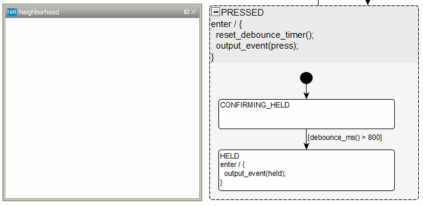
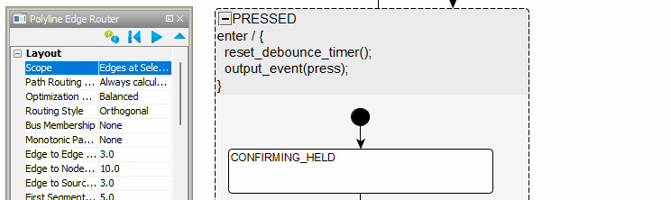
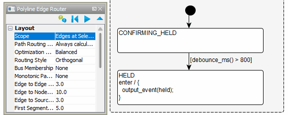

We will eventually add a new supported front end other than yEd, but for now, here's how to use it well.
It's actually a pretty great program once you get used to it.

# Settings to save your sanity

## `File > Preferences > Editor`
- Ensure that `Create Node on Background Click` is deselected! This appears to be a default in the latest versions of yEd so you hopefully don't need to worry about it.
- ⚠️ Ensure that `Synchronize Open and Closed Group Label` is selected! Otherwise the label for a group can be different depending on whether it is open or closed. Bad times.
- Adjust the remaining settings as you see fit. I generally leave them alone.

  

## `File > Preferences > General`
- I recommend setting `Tooltips` to `No Tooltips`. Otherwise, it is super distracting.

  


# Changing edge style
Open the Pallette from `Windows > Pallette` and open the `Edge Types` tab. Choose the edge style that you like. Right click on it and click `Use as Default`.

  

# Cautions
## yEd does not detect file changes
yEd will not detect when a .graphml changes from something like changing git branches. yEd loads the diagram into RAM and then writes to disk. It's a one way street. If you do any git operations or file modifications outside of yEd, make sure to close and re-open the file in yEd.

## yEd Hidden Edges
[Issue 29](https://github.com/StateSmith/StateSmith/issues/29)

Starting in 0.5.7, StateSmith will detect accidental blank edges and throw an exception with the diagram id of the edge for quick fixing.

### Accidental Transitions to Ancestor
One particularly annoying yEd bug is that it is possible to accidentally draw an edge from a substate to its parent that disappears. The edge is still there, you just can't see it. If you notice this happen, you can open the `Neighborhood` view with the state selected. It will show the hidden edge and allow you to select and delete it. 



The `Polyline Edge Router` will often move the edge so that it becomes visible too.



Starting in 0.5.7, StateSmith will detect this and throw an exception:

```console
StateSmith Runner - Compiling file: `ButtonSm1Cpp/ButtonSm1Cpp.graphml`
Exception thrown: 'StateSmith.Compiling.BehaviorValidationException' in StateSmith.dll
BehaviorValidationException: yEd hidden edge to ancestor detected. See https://github.com/StateSmith/StateSmith/issues/29 .
    Behavior
    Owning vertex: Statemachine{ButtonSm1Cpp}.State{PRESSED}.State{CONFIRMING_HELD}
    Target vertex: Statemachine{ButtonSm1Cpp}.State{PRESSED}
    Order: default
    Triggers: ``
    Guard: ``
    Action: ``
    Via Entry: ``
    Via Exit : ``
    Diagram Id: `n0::e3`

StateSmith Runner - finished with failure.
```

### Accidental Self Transitions
You can also accidentally draw an edge from a state to itself in such a way that yEd makes it invisible. In this case, the `Neighborhood` view can't help. You can either use the `Polyline Edge Router` so that you can see it again, or you can manually edit the .xml file.



If you don't want to keep the auto routing changes, you can do the auto routing to make the edge visible, select the bad edge, `CTRL+Z` to undo the auto routing (the edge becomes invisible again but is selected), then use the keyboard `DELETE` key to remove it.

Starting in 0.5.7, StateSmith will detect this and throw an exception:

```console
StateSmith Runner - Compiling file: `ButtonSm1Cpp/ButtonSm1Cpp.graphml`
Exception thrown: 'StateSmith.Compiling.BehaviorValidationException' in StateSmith.dll
BehaviorValidationException: yEd hidden self-to-self edge detected. See https://github.com/StateSmith/StateSmith/issues/29 .
    Behavior
    Owning vertex: Statemachine{ButtonSm1Cpp}.State{PRESSED}.State{CONFIRMING_HELD}
    Target vertex: Statemachine{ButtonSm1Cpp}.State{PRESSED}.State{CONFIRMING_HELD}
    Order: default
    Triggers: ``
    Guard: ``
    Action: ``
    Via Entry: ``
    Via Exit : ``
    Diagram Id: `n0::n2::e2`

StateSmith Runner - finished with failure.
```

Open the .graphml file and search for the Diagram Id (`n0::n2::e2` in our example) and delete it.

```xml
        <edge id="n0::n2::e2" source="n0::n2::n0" target="n0::n2::n0">
          <data key="d9"/>
          <data key="d10">
            <y:QuadCurveEdge straightness="0.1">
              <y:Path sx="0.0" sy="0.0" tx="0.0" ty="0.0"/>
              <y:LineStyle color="#000000" type="line" width="1.0"/>
              <y:Arrows source="none" target="standard"/>
            </y:QuadCurveEdge>
          </data>
        </edge>
```


# Training
I plan to make a short youtube video going over just what you need with yEd, but in the mean time, try opening
[./yed-training-tips.graphml](./yed-training-tips.graphml) with yEd and working through the exercises.

# General Tips

By default, mouse wheel zooms in/out. Right click and drag pans.

How to add or remove an existing node to/from groups see http://yed.yworks.com/support/qa/6053/is-it-possible-to-add-move-an-object-to-existing-group

When pasting copied shapes, sometimes right click paste will work better. There's also `Paste into selected group`.

## Auto label placement
The auto label placement can be pretty helpful when applied to edges. It also changes the label positioning model to `Free` which allows more customized placement. Wish I could make that the default.

Open dialog from `Layout > Label Placement`. Ensure that `Place Node Labels` is not selected and `Place Edge Labels` is. 

This is a handy thing to have well... handy. I dock it and use these settings

  


# More...

yWorks training [youtube videos](https://www.youtube.com/watch?v=OmSTwKw7dX4&list=PLpIlEtPgrZsUA28PlP2tdRERcMIVn5AUT&index=1&ab_channel=yWorks).

Please share your tips if you find something that works well.

# TODO
- Document best edge router settings. User feedback also appreciated here.
