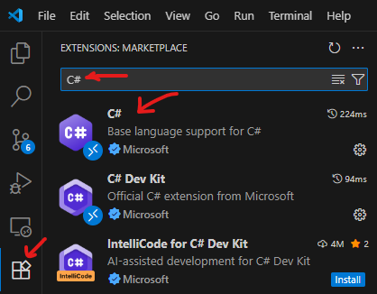
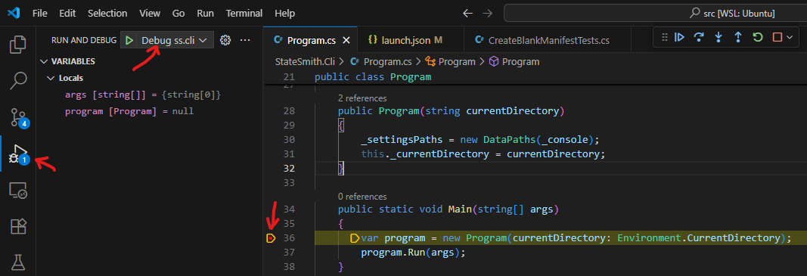
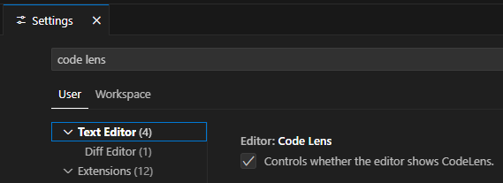
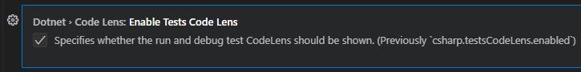
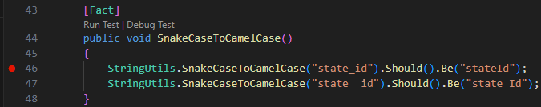
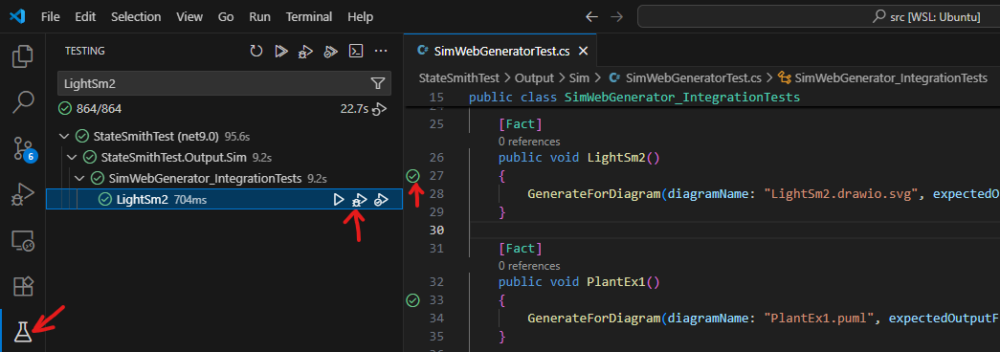

vscode is my general recommendation.

A solid IDE for C# development. Provides easy intellisense, code navigation, debugging, test running/debugging...

See [ide.md](./ide.md) for pros/cons and alternatives.

# NOTE!
Please help me keep this up to date with current recommendations, tips, tricks... vscode development can move quickly.

  

# Install
> 🚩 Ensure that you can build with a regular terminal first (AKA you've installed a dotnet SDK). See `build-*.md` files.

Search C# in vscode extensions and click install.

You'll be asked if you want to download `C# Dev Kit` as well. It is nice for testing, but *not* required. See [ide.md](./ide.md) for pros/cons.

  

# How To Use
Open StateSmith `src` directory with vscode.
> 🤔 Actually, I think you can now open the main StateSmith directory and follow the same steps.

In the bottom right hand corner, a pop up will say:
> "Your workspace has multiple Visual Studio Solution files; please select one to get full intellisense".

Click `Choose` or `Choose and set default`.

Select `StateSmith.sln`.

If you didn't get this popup, open vscode command palette and type `Open Solution` then select `.NET: Open Solution`.

  

# Building
Regular vscode hotkeys. Try `CTRL+SHIFT+B` or command palette.

  

# Debugging ss.cli
If you have vscode opened in the StateSmith `src` directory, you should be able to just hit `F5`. Or select `Debug ss.cli` from `RUN AND DEBUG` side bar (see image below).

Try setting a breakpoint in Program.cs `Main()` method.

  

# Run/Debug Unit Tests (no C# Dev Kit)
At least two options.

## Using Code Lens
Make sure `Code Lens` is enabled in vscode settings.

Then scroll down a bit and enable Code Lens for test as well:

You can then navigate to some test code and run individual tests or debug them:

## From Command Palette
Sometimes code lens can be annoying so I turn it off. How to run tests then?

1. put your mouse in the test method that you want to debug
2. open command palette and select `.NET: Run/Debug Tests in Context`

  

# Run/Debug Unit Tests (C# Dev Kit)
This is one area where C# Dev Kit is nicer. The Testing sidebar.

You can search for tests and easily run them or debug them. Lots of options. Can click or right click green arrow next to code as well.

*Note: Code Lens references is not required in image above for this to work.*
