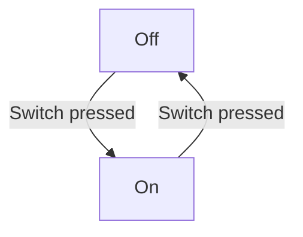

# Integrating with GitHub

There are a few ways StateSmith makes it easy to integrate with GitHub. You can easily display state machine diagrams on GitHub Docs and Pages. You can use GitHub Actions to automatically generate state machine source code on push. Read on for more details.

## Displaying Diagrams using PlantUML

You can use GitHub Actions to convert your PlantUML files to SVG, which can then be displayed in GitHub Docs and Pages.

The following recipe will find all PlantUML files in your repository, generate a corresponding SVG, and then commit the SVG to your repo.

TODO convert this to using statesmith once statesmith supports image generation

```
# Add this recipe to your repo here: .github/workflows/puml-to-svg.yml

name: Generate PlantUML Diagrams
on:
  push:

permissions:
  # Give the default GITHUB_TOKEN write permission to commit and push the
  # added or changed files to the repository.
  contents: write

jobs:
  plantuml:
    runs-on: ubuntu-latest
    steps:
      - name: Checkout Source
        uses: actions/checkout@v4

      - name: Generate SVG Diagrams
        uses: holowinski/plantuml-github-action@1.2021.1
        with:
          # plantuml command line options: https://plantuml.com/command-line 
          args: -v -tsvg **.puml

      - name: Push Local Changes
        uses: stefanzweifel/git-auto-commit-action@v5
        with:
          commit_message: "Generate SVG files for PlantUML diagrams"
          branch: ${{ github.head_ref }}
```

Other image formats such as PNG are easily achievable by modifying the formula slightly.

You can use the generated images in markdown or html:

```
  
```
```

```


## Displaying PlantUML files on GitHub Pages

GitHub Pages allows you to use Jekyll directives to do things like include files in the rendered output.
You can add an include like the following to include your PlantUML code directly into your documentation.

```



```

<pre>

</pre>

This does not do anything on GitHub Docs markdown. It will only be processed for GitHub Pages. See how we use it [here](https://github.com/emmby/StateSmith/edit/main/docs/integrations/github.md).


## Displaying Diagrams using draw.io

draw.io diagrams are just SVG, so they work on webpages out of the box!

Upload your images to GitHub and using markdown or html to render them, eg. 

```
  
```
```

```

TODO drawio example svg

## Generating code on commit using StateSmith GitHub Actions

TODO


## Displaying Diagrams using Mermaid

> [!NOTE]
> StateSmith does not natively support Mermaid. If you use mermaid diagrams in your docs
> you will need to find another way to keep them in sync with your code. We recommend
> one of the other diagramming solutions for GitHub, such as PlantUML or draw.io above.

GitHub Markdown has native support for Mermaid. Mermaid's Flowchart diagrams offer a close approximation 
to state diagrams and can represent many or most of what you might want to achieve in your state machines.


These diagrams will display properly in your README.md and other markdown files when viewed on GitHub.

#### GitHub Pages

By default, GitHub Pages do not natively display Mermaid diagrams. But you can customize the template
used to generate your pages to add Mermaid rendering. Stackoverflow has suggestions on how to do this.
