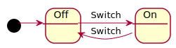

# Quickstart


## Installation

You can install statesmith using many common package managers:

```
 Mac homebrew: ...
```

```
 Linux apt-get:
```

```
 Windows nuget:
```


If you don't want to use one of the methods above, you can always download the binary directly:
* download link


## Create a State Machine

Let's create our first state machine. We'll use PlantUML to get started quickly. Later you can try one of our other supported diagraming formats.

<table>
<tr>
<td>



</td>
<td>
<pre>

</pre>
</td>
</tr>
</table>

## Generate the JavaScript Code

Now run `statesmith` to generate code for this state machine.

```
% statesmith --lang=js lightbulb.puml
```

## View the State Machine

Take a look at the generated files on the disk. They should look pretty similar to the ones in the links below.

* [lightbulb.js](lightbulb.js): This is the **generated JavaScript state machine.** You can include this state machine in your JavaScript apps.
* [lightbulb.sim.html](lightbulb.sim.html): A simple simulator that runs your statemachine and allows you to interact with it.

Open the `lightbulb.sim.html` simulator in your web browser. Here's the same simulator hosted on github: [lightbulb.sim.html simulator](https://emmby.github.io/StateSmith/quickstart/lightbulb.sim.html)


<iframe height="300" width="600" src="https://emmby.github.io/StateSmith/quickstart/lightbulb.sim.html"></iframe>

Try clicking the `Switch` button on the right and watch the diagram update with the active state. You'll also see the event recorded in the event history on the right hand side.


## Next Steps

Congratulations! You've generated your first StateSmith state machine and played around in it with our built in simulator.

Continue next to the Languages section to see how to generate state machine in C, C++, C#, Java, Python, TypeScript, or one of our other supported languges. 
