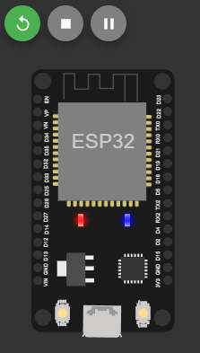
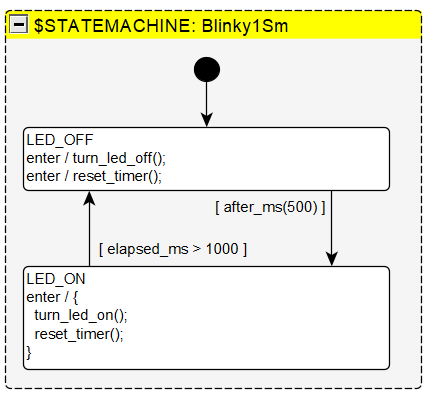
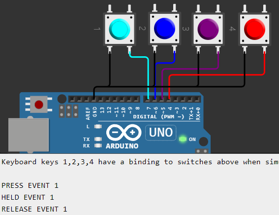

# NOTE! These examples are a bit outdated
Please see https://github.com/StateSmith/example-drawio-1 instead.

I'm currently working on a multi-programming language tutorial as well.

---

The best way to learn something is by doing. This directory has a bunch of examples you can explore.

🌿 A few of the below examples also have PlantUML files.

# [Tutorial1-blank](./Tutorial1-blank/)
- This is the starting point for [quick-start.md](../docs/quickstart1/quick-start.md).
- Recommended to start here.

# [Tutorial1-complete](./Tutorial1-complete/)
- The completed result of [quick-start.md](../docs/quickstart1/quick-start.md).

# [Blinky1](./Blinky1/)
- Shows how to generate c++ instead of c for convenient use with Arduino.
- The generated state machine user code calls Arduino C++ code directly.
- Includes an online simulation that blinks an ESP32 module's onboard LED.
- Illustrates how to get started using timers in a state machine.

    


# [blinky1_printf_sm](./Blinky1Printf/) 🌿
- Blinks an LED on a console.
- Has PlantUML 🌿 and yEd diagram files. Search for `usePlantUmlInput` and set it to true.
- User code changes StateSmith name mangling to more conventional snake case naming.
- Illustrates how to get started using timers in a state machine.
- Can be compiled and run on any platform with a console.


 
  


# [ButtonSm1Cpp](./ButtonSm1Cpp/)
- Debounces buttons and outputs PRESS, HELD, and RELEASE events.
- Shows how to run 4 instances of a state machine.
- Has PlantUML 🌿 and yEd diagram files. Search for `usePlantUmlInput` and set it to true.
- Uses bitfields in user variables.
- Online Arduino simulation.

  


  


```c
struct ButtonSm1Cpp
{
    // <snip> ...
    
    // User variables. Can be used for inputs, outputs, user variables...
    struct
    {
        uint32_t debounce_started_at_ms;
        
        uint16_t input_is_pressed : 1; // input
        uint16_t output_event_press : 1; // output
        uint16_t output_event_release : 1; // output
        uint16_t output_event_held : 1; // output
        uint16_t output_event_tap : 1; // output
    } vars;
};
```

# [LaserTagMenu1](./LaserTagMenu1/)
- The most complicated example.
- Shows how to create a sophisticated multilayered LCD menu system for Laser Tag! Pew pew!
- Outputs c code, but links with c++ Arduino code.
- Prints state names on change.
- Button debouncing.


Here's the menu layout:
```
APP
├── HOME
│   ├── HOME1
│   ├── HOME2
│   └── HOME3
└── MAIN MENU
        ├── SELECT CLASS
        │   ├── ENGINEER
        │   ├── HEAVY
        │   ├── ARCHER
        │   ├── WIZARD
        │   └── SPY
        │── SHOW INFO
        │   ├── INFO 1
        │   ├── INFO 2
        │   └── INFO 3
        └── EAT BACK PRESSES
            └── <stuff to show event handling>
```
