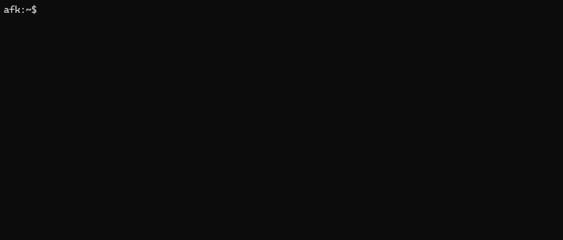
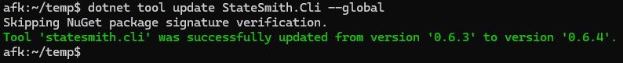
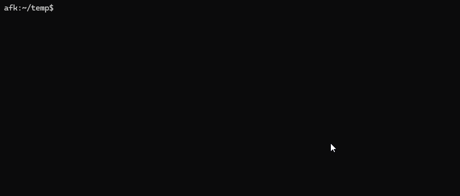

# StateSmith CLI
A massive step up in productivity. Create and setup new projects in seconds!

This tool is brand new (2024-05-06) and ready for early access. We've already fixed a few issues and it is working quite well right now. Please open an issue if you encounter any issues.

**Video Walkthough**: https://www.youtube.com/watch?v=2y1tLmNpz78

## Install
Follow the main [install instructions for StateSmith](https://github.com/StateSmith/StateSmith/wiki/StateSmith-install-requirements).

Then install the CLI tool with the following command:
```
dotnet tool install --global StateSmith.Cli
```

`--global` will put the tool in a location that is in your PATH. This will allow you to run the tool with the `ss.cli` command from any directory.

<!--   -->

## Updating
Issue the command:
```
dotnet tool update --global StateSmith.Cli
```



## Usage
### Create a new project
```
ss.cli create
```

This will bring up a wizard that guides you through quickly creating a new StateSmith project. It remembers your choices for the next time you run the command so you should only need to enter in the project name and then hit enter a few times to create a new project.



### Run StateSmith code generation
```
ss.cli run --here
```


## Uninstall
Issue the command
```
dotnet tool uninstall --global StateSmith.Cli
```

## Install Specific Version or Test Release
Test releases are usually unlisted on nuget website. They also aren't detected by ss.cli update checks.
```
dotnet tool install --global StateSmith.Cli --allow-downgrade --version 0.8.2-diag-only-1
```
