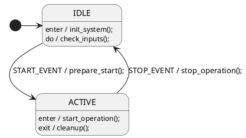
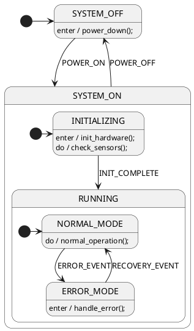
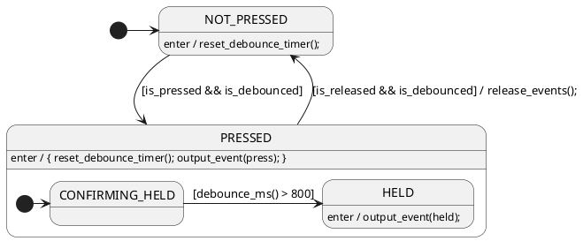

# StateSmith 测试运行教程

## 快速开始

如果您急于开始测试，可以直接运行我们提供的测试脚本：

```powershell
# 进入项目目录
cd C:\Users\Administrator\Desktop\StateSmith\src

# 运行开发环境测试脚本
.\test-dev.ps1
```

这个脚本会自动：
1. 清理之前的构建
2. 重新构建项目
3. 运行核心测试（跳过外部依赖测试）
4. 显示结果和建议

## 项目概览

StateSmith 是一个状态机代码生成器项目，使用 .NET/C# 开发。项目包含以下主要组件：

- **StateSmith**: 核心库项目
- **StateSmith.Cli**: 命令行工具项目  
- **StateSmithTest**: 核心库的单元测试
- **StateSmith.CliTest**: CLI工具的单元测试

## 环境要求

### 必需环境
- **.NET SDK**: 项目需要 .NET 8.0 或更高版本
- **操作系统**: Windows, macOS, 或 Linux

### 可选环境（用于完整测试）
- **TypeScript编译器 (tsc)**: 用于 TypeScript 相关测试
- **C编译器**: 用于 C 代码生成测试
- **Java**: 用于 Java 代码生成测试
- **Python**: 用于 Python 代码生成测试

## 基本测试命令

### 1. 检查环境
```powershell
# 检查 .NET 版本
dotnet --version

# 进入项目根目录
cd C:\Users\Administrator\Desktop\StateSmith\src
```

### 2. 构建项目
```powershell
# 构建整个解决方案
dotnet build

# 构建特定项目
dotnet build StateSmith\StateSmith.csproj
dotnet build StateSmithTest\StateSmithTest.csproj
```

### 3. 运行测试

#### 运行所有测试
```powershell
dotnet test
```

#### 运行特定项目的测试
```powershell
# 只运行核心库测试
dotnet test StateSmithTest\StateSmithTest.csproj

# 只运行CLI测试
dotnet test StateSmith.CliTest\StateSmith.CliTest.csproj
```

#### 运行特定测试类
```powershell
# 运行特定测试类
dotnet test --filter "ClassName=BehaviorTests"

# 运行包含特定名称的测试
dotnet test --filter "Name~Choice"
```

#### 详细输出
```powershell
# 显示详细测试输出
dotnet test --verbosity normal

# 显示所有输出
dotnet test --verbosity detailed
```

## 跳过特定测试

如果您的环境缺少某些依赖（如 TypeScript 编译器），可以跳过相关测试：

### 跳过 TypeScript 测试
```powershell
dotnet test --filter "FullyQualifiedName!~TypeScript"
```

### 跳过多种语言测试
```powershell
dotnet test --filter "FullyQualifiedName!~TypeScript&FullyQualifiedName!~Java&FullyQualifiedName!~Python"
```

## 代码修改后的测试流程

### 1. 修改代码后的标准流程
```powershell
# 1. 清理之前的构建
dotnet clean

# 2. 重新构建项目
dotnet build

# 3. 运行相关测试
dotnet test

# 4. 如果有失败，运行特定测试进行调试
dotnet test --filter "Name~YourTestName" --verbosity detailed
```

### 2. 针对特定模块的测试
```powershell
# 如果修改了输入处理相关代码
dotnet test --filter "FullyQualifiedName~Input"

# 如果修改了输出生成相关代码  
dotnet test --filter "FullyQualifiedName~Output"

# 如果修改了状态机图相关代码
dotnet test --filter "FullyQualifiedName~SmGraph"
```

### 3. 回归测试
```powershell
# 运行所有核心测试（跳过可能有环境依赖的测试）
dotnet test StateSmithTest\StateSmithTest.csproj --filter "FullyQualifiedName!~TypeScript&FullyQualifiedName!~Java"
```

## 测试结果解读

### 成功的测试运行（理想情况）
```
测试摘要: 总计: 674, 失败: 0, 成功: 674, 已跳过: 0
```

### 典型的开发环境测试结果
```
测试摘要: 总计: 520, 失败: 2, 成功: 517, 已跳过: 1
```
这是一个良好的结果，说明核心功能正常，只有少量依赖外部环境的测试失败。

### 有大量失败的测试运行（缺少依赖）
```
测试摘要: 总计: 860, 失败: 186, 成功: 673, 已跳过: 1
```

### 常见测试失败原因

1. **缺少 TypeScript 编译器**
   - 错误信息: `'tsc' 不是内部或外部命令`
   - 解决方案: 安装 TypeScript 或跳过相关测试

2. **缺少 WSL (Windows Subsystem for Linux)**
   - 错误信息: `?u嶯 Linux 剉 Windows P[鹼邁`
   - 解决方案: 安装 WSL 或跳过 C 编译测试

3. **编译错误**
   - 错误信息: `CS8603: 可能返回 null 引用`
   - 解决方案: 修复代码中的 null 引用警告

4. **路径问题**
   - 确保在正确的目录下运行命令

## 持续集成建议

### 开发环境测试脚本
创建 `test-dev.ps1` 脚本：
```powershell
# 开发环境测试脚本
Write-Host "开始构建和测试..." -ForegroundColor Green

# 清理和构建
dotnet clean
dotnet build

if ($LASTEXITCODE -ne 0) {
    Write-Host "构建失败!" -ForegroundColor Red
    exit 1
}

# 运行核心测试（跳过需要外部依赖的测试）
Write-Host "运行核心测试..." -ForegroundColor Yellow
dotnet test StateSmithTest\StateSmithTest.csproj --filter "FullyQualifiedName!~TypeScript&FullyQualifiedName!~Java&FullyQualifiedName!~Python"

Write-Host "运行CLI测试..." -ForegroundColor Yellow  
dotnet test StateSmith.CliTest\StateSmith.CliTest.csproj

Write-Host "测试完成!" -ForegroundColor Green
```

### 完整测试脚本
创建 `test-full.ps1` 脚本：
```powershell
# 完整测试脚本（需要所有依赖）
Write-Host "开始完整测试..." -ForegroundColor Green

# 检查依赖
$deps = @("tsc", "java", "python")
foreach ($dep in $deps) {
    if (!(Get-Command $dep -ErrorAction SilentlyContinue)) {
        Write-Host "警告: 未找到 $dep" -ForegroundColor Yellow
    }
}

# 运行所有测试
dotnet test --verbosity normal
```

## 调试测试

### 1. 运行单个测试
```powershell
dotnet test --filter "FullyQualifiedName=StateSmithTest.BehaviorTests.TestMethodName"
```

### 2. 使用 Visual Studio
- 打开 `StateSmith.sln`
- 在测试资源管理器中运行特定测试
- 设置断点进行调试

### 3. 查看测试输出
```powershell
dotnet test --logger "console;verbosity=detailed"
```

## 性能测试

### 测量测试运行时间
```powershell
Measure-Command { dotnet test }
```

### 并行测试执行
```powershell
dotnet test --parallel
```

## 故障排除

### 常见问题及解决方案

1. **测试发现失败**
   ```powershell
   dotnet restore
   dotnet build
   ```

2. **权限问题**
   - 以管理员身份运行 PowerShell

3. **路径过长问题**
   - 将项目移到较短的路径

4. **内存不足**
   ```powershell
   dotnet test --blame-hang-timeout 5m
   ```

## 总结

这个测试框架使用 xUnit 作为测试框架，支持：
- 单元测试
- 集成测试  
- 跨语言代码生成测试
- 性能测试

建议的开发工作流：
1. 修改代码
2. 运行 `dotnet build` 确保编译通过
3. 运行相关测试验证功能
4. 提交前运行完整测试套件

通过合理使用测试过滤器，您可以根据开发环境和需求选择运行不同级别的测试。

## `dotnet test` 工作原理详解

### 为什么 `dotnet test` 能够自动发现和运行测试？

#### 1. 测试框架识别机制

当您运行 `dotnet test` 时，它会经历以下步骤：

**第一步：项目文件分析**
```xml
<!-- StateSmithTest.csproj 中的关键配置 -->
<PackageReference Include="Microsoft.NET.Test.Sdk" Version="16.5.0" />
<PackageReference Include="xunit" Version="2.4.0" />
<PackageReference Include="xunit.runner.visualstudio" Version="2.4.0" />
```

- `Microsoft.NET.Test.Sdk`: 提供测试发现和执行的核心基础设施
- `xunit`: 测试框架，提供 `[Fact]`、`[Theory]` 等测试属性
- `xunit.runner.visualstudio`: 测试运行器，让 dotnet CLI 能识别 xUnit 测试

**第二步：编译和程序集扫描**
```powershell
# dotnet test 内部执行的步骤
1. dotnet restore  # 还原 NuGet 包
2. dotnet build    # 编译项目
3. 扫描编译后的 .dll 文件
4. 查找测试类和测试方法
```

**第三步：测试发现**
系统会扫描程序集中的：
- 带有 `[Fact]` 属性的方法（无参数测试）
- 带有 `[Theory]` 属性的方法（参数化测试）
- 实现了测试接口的类

#### 2. 测试执行流程

**测试分类和组织**
从我们看到的测试列表中，可以看到测试被组织为：

```
StateSmithTest.BehaviorTests.DescribeAsUml
StateSmithTest.Antlr.Antlr4Test.StateNameOnly
Spec.Spec2.CSharp.Spec2TestsCSharp.Test1_DoEventHandling
```

这个命名约定表示：
- `StateSmithTest`: 测试项目命名空间
- `BehaviorTests`: 测试类名
- `DescribeAsUml`: 具体的测试方法名

**测试执行顺序**
- 测试通常并行执行以提高速度
- 每个测试方法在独立的上下文中运行
- 测试失败不会影响其他测试的执行

#### 3. 测试结果收集

**结果聚合**
```
测试摘要: 总计: 520, 失败: 2, 成功: 517, 已跳过: 1
```

这个摘要告诉我们：
- **总计**: 发现并尝试运行的测试总数
- **成功**: 通过的测试数量
- **失败**: 断言失败或抛出异常的测试
- **已跳过**: 被条件跳过的测试（如 `[Skip]` 属性）

#### 4. 高级功能

**测试过滤**
```powershell
# 过滤器语法解释
--filter "FullyQualifiedName~TypeScript"  # 包含 TypeScript 的测试
--filter "FullyQualifiedName!~TypeScript" # 不包含 TypeScript 的测试
--filter "Category=Integration"           # 特定类别的测试
```

**并行执行**
- xUnit 默认并行运行同一程序集内的测试类
- 可以通过配置控制并行度
- 某些测试可能需要串行执行（如文件系统操作）

### StateSmith 项目的测试特点

#### 1. 多语言代码生成测试
项目包含针对多种目标语言的测试：
- C/C++ 代码生成测试
- C# 代码生成测试  
- JavaScript/TypeScript 代码生成测试
- Java 代码生成测试
- Python 代码生成测试

#### 2. 集成测试策略
- **Spec 测试**: 验证生成的状态机代码的行为正确性
- **编译测试**: 确保生成的代码能够成功编译
- **功能测试**: 验证状态机的状态转换逻辑

#### 3. 依赖管理
某些测试需要外部工具：
- TypeScript 编译器 (tsc)
- C 编译器 (gcc/clang)
- Java 编译器 (javac)
- Python 解释器

这就是为什么在没有这些依赖的环境中，部分测试会失败。

### 实际运行示例

当您运行 `dotnet test` 时，内部发生的事情：

```
1. [0.0s] 开始测试发现
2. [0.1s] 还原 NuGet 包
3. [0.3s] 编译 StateSmith 项目
4. [0.5s] 编译 StateSmithTest 项目  
5. [1.0s] 发现 520 个测试方法
6. [1.1s] 开始并行执行测试
7. [30s]  收集测试结果
8. [30s]  输出测试摘要
```

这个过程完全自动化，无需手动配置测试运行器或指定测试文件。 

## 使用 .puml 文件转换为代码

StateSmith 支持多种输入格式，包括 PlantUML (.puml) 文件。以下是将 .puml 状态机图转换为代码的完整指南。

### 支持的文件格式

StateSmith 支持以下输入格式：
- **PlantUML**: `.pu`, `.puml`, `.plantuml`
- **yEd**: `.graphml`
- **Draw.io**: `.drawio`, `.drawio.svg`

### 方法一：使用 CLI 工具（推荐）

#### 1. 构建 CLI 工具

```powershell
# 在项目根目录下
cd C:\Users\Administrator\Desktop\StateSmith\src
dotnet build StateSmith.Cli/StateSmith.Cli.csproj
```

#### 2. 使用 CLI 处理 .puml 文件

```powershell
# 处理单个 .puml 文件
dotnet StateSmith.Cli/bin/Debug/net8.0/StateSmith.Cli.dll run your_state_machine.puml

# 处理多个 .puml 文件
dotnet StateSmith.Cli/bin/Debug/net8.0/StateSmith.Cli.dll run *.puml

# 监视文件变化并自动重新生成
dotnet StateSmith.Cli/bin/Debug/net8.0/StateSmith.Cli.dll run --watch your_state_machine.puml
```

#### 3. CLI 工具的其他功能

```powershell
# 查看帮助
dotnet StateSmith.Cli/bin/Debug/net8.0/StateSmith.Cli.dll --help

# 创建新项目模板
dotnet StateSmith.Cli/bin/Debug/net8.0/StateSmith.Cli.dll create

# 设置 VSCode 环境
dotnet StateSmith.Cli/bin/Debug/net8.0/StateSmith.Cli.dll setup
```

### 方法二：编程方式（自定义控制）

#### 1. 创建代码生成配置文件

创建一个 C# 文件（例如 `MyStateMachine.cs`）：

```csharp
using StateSmith.Input.Expansions;
using StateSmith.Output;
using StateSmith.Output.Gil.C99;
using StateSmith.Output.UserConfig;
using StateSmith.Runner;
using StateSmith.SmGraph;

namespace MyProject
{
    public class MyStateMachine
    {
        public static void GenFile()
        {
            // 指定 .puml 文件路径
            var diagramFileName = "MyStateMachine.puml";

            // 创建状态机运行器
            SmRunner runner = new(diagramPath: diagramFileName, new MyGlueFile());
            runner.Run();
        }

        // 配置代码生成选项
        public class MyGlueFile : IRenderConfigC
        {
            // 生成 C++ 代码而不是 C 代码
            string IRenderConfigC.CFileExtension => ".cpp";
            string IRenderConfigC.HFileExtension => ".h";

            // 头文件包含
            string IRenderConfigC.HFileIncludes => @"
                #include <stdint.h>
                // 其他需要的头文件
            ";

            // 源文件包含
            string IRenderConfigC.CFileIncludes => @"
                #include ""Arduino.h""
                // 其他需要的源文件包含
            ";

            // 用户变量声明
            string IRenderConfig.VariableDeclarations => @"
                uint32_t timer_ms;
                bool input_button_pressed;
                bool output_led_state;
            ";

            // 扩展功能类
            public class Expansions : UserExpansionScriptBase
            {
                // 时间获取函数
                public string time_ms => "millis()";
                
                // 输入检测
                public string is_button_pressed => "digitalRead(BUTTON_PIN)";
                
                // 输出控制
                public string set_led(string state) => $"digitalWrite(LED_PIN, {state})";
                
                // 定时器功能
                public string start_timer() => $"timer_ms = {time_ms}";
                public string timer_elapsed(string ms) => $"({time_ms} - timer_ms >= {ms})";
            }
        }
    }
}
```

#### 2. 创建运行程序

创建 `Program.cs` 文件：

```csharp
Console.WriteLine("开始生成状态机代码...");

MyProject.MyStateMachine.GenFile();

Console.WriteLine("状态机代码生成完成！");
```

#### 3. 运行代码生成

```powershell
# 编译并运行
dotnet run
```

### PlantUML 文件格式示例

#### 基本状态机结构



#### 带有嵌套状态的复杂状态机



### 实际示例：按钮状态机

参考项目中的 `ButtonSm1Cpp.puml` 示例：



### 运行示例

#### 1. 使用现有示例

```powershell
# 进入示例目录
cd test-misc/examples/ButtonSm1Cpp/CodeGen

# 运行代码生成
dotnet run
```

#### 2. 修改示例使用 .puml 文件

编辑 `ButtonSm1Cpp.cs` 文件：

```csharp
public static void GenFile()
{
    var diagramFileName = "ButtonSm1Cpp.graphml";

    // 改为使用 PlantUML 文件
    bool usePlantUmlInput = true;  // 设置为 true
    if (usePlantUmlInput)
    {
        diagramFileName = "ButtonSm1Cpp.puml";
    }

    SmRunner runner = new(diagramPath: $"../ButtonSm1Cpp/{diagramFileName}", new MyGlueFile());
    runner.Run();
}
```

### 生成的代码结构

StateSmith 会生成以下文件：

```
MyStateMachine.h      // 头文件，包含状态机结构定义
MyStateMachine.cpp    // 源文件，包含状态机实现
```

#### 生成的 C++ 代码示例

**头文件 (MyStateMachine.h)**:
```cpp
#pragma once
#include <stdint.h>

typedef struct MyStateMachine MyStateMachine;

struct MyStateMachine
{
    uint32_t timer_ms;
    bool input_button_pressed;
    bool output_led_state;
    
    // 状态机内部状态
    uint8_t state_id;
};

// 状态机函数
void MyStateMachine_ctor(MyStateMachine* self);
void MyStateMachine_start(MyStateMachine* self);
void MyStateMachine_dispatch_event(MyStateMachine* self, uint16_t event_id);
```

**源文件 (MyStateMachine.cpp)**:
```cpp
#include "MyStateMachine.h"
#include "Arduino.h"

// 状态 ID 定义
enum {
    MyStateMachine_StateId_ROOT = 0,
    MyStateMachine_StateId_IDLE = 1,
    MyStateMachine_StateId_ACTIVE = 2,
};

// 事件 ID 定义
enum {
    MyStateMachine_EventId_START_EVENT = 0,
    MyStateMachine_EventId_STOP_EVENT = 1,
};

// 状态机实现
void MyStateMachine_ctor(MyStateMachine* self)
{
    self->state_id = MyStateMachine_StateId_ROOT;
    // 初始化用户变量
}

// ... 其他实现代码
```

### 故障排除

#### 常见问题

1. **PlantUML 语法错误**
   ```
   错误: PlantUML input failed parsing
   ```
   解决方案：检查 .puml 文件语法，确保有正确的 `@startuml` 和 `@enduml` 标记

2. **文件路径问题**
   ```
   错误: Could not find file 'MyStateMachine.puml'
   ```
   解决方案：确保 .puml 文件路径正确，使用相对路径或绝对路径

3. **编译错误**
   ```
   错误: CS0234: 命名空间中不存在类型或命名空间名
   ```
   解决方案：确保已正确引用 StateSmith 库

#### 调试技巧

1. **启用详细输出**
   ```csharp
   SmRunner runner = new(diagramPath: diagramFileName, new MyGlueFile());
   runner.Settings.dumpErrorsToFile = true;
   runner.Settings.dumpGilCodeOnError = true;
   runner.Run();
   ```

2. **检查生成的中间文件**
   StateSmith 会生成 `.gil.cs.txt` 文件，包含中间代码表示

3. **使用测试项目验证**
   ```powershell
   # 运行相关测试
   dotnet test --filter "FullyQualifiedName~PlantUML"
   ```

### 最佳实践

1. **文件组织**
   ```
   MyProject/
   ├── diagrams/
   │   └── MyStateMachine.puml
   ├── generated/
   │   ├── MyStateMachine.h
   │   └── MyStateMachine.cpp
   └── CodeGen/
       ├── MyStateMachine.cs
       └── Program.cs
   ```

2. **版本控制**
   - 将 .puml 文件加入版本控制
   - 生成的代码文件可以选择性加入版本控制
   - 使用 `.gitignore` 排除临时文件

3. **持续集成**
   ```powershell
   # 在 CI/CD 脚本中
   dotnet build
   dotnet run --project CodeGen
   # 编译生成的代码验证正确性
   ```

通过以上方法，您可以轻松地将 .puml 状态机图转换为可执行的代码，支持多种编程语言和平台。 
